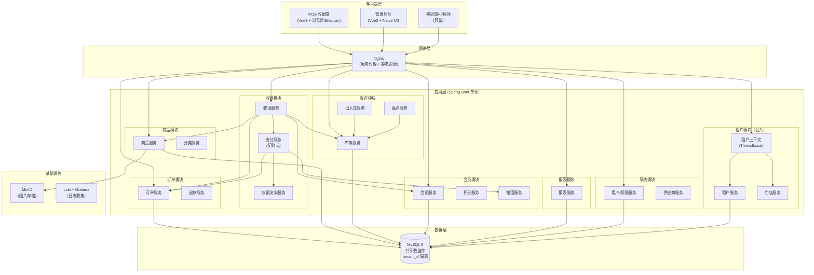
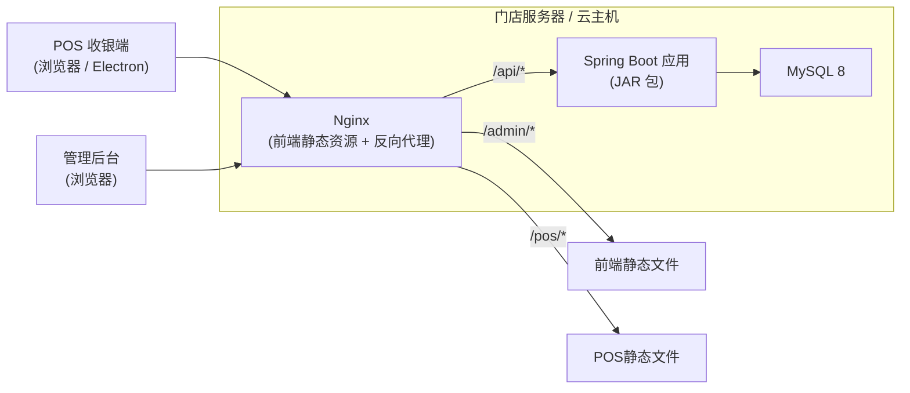
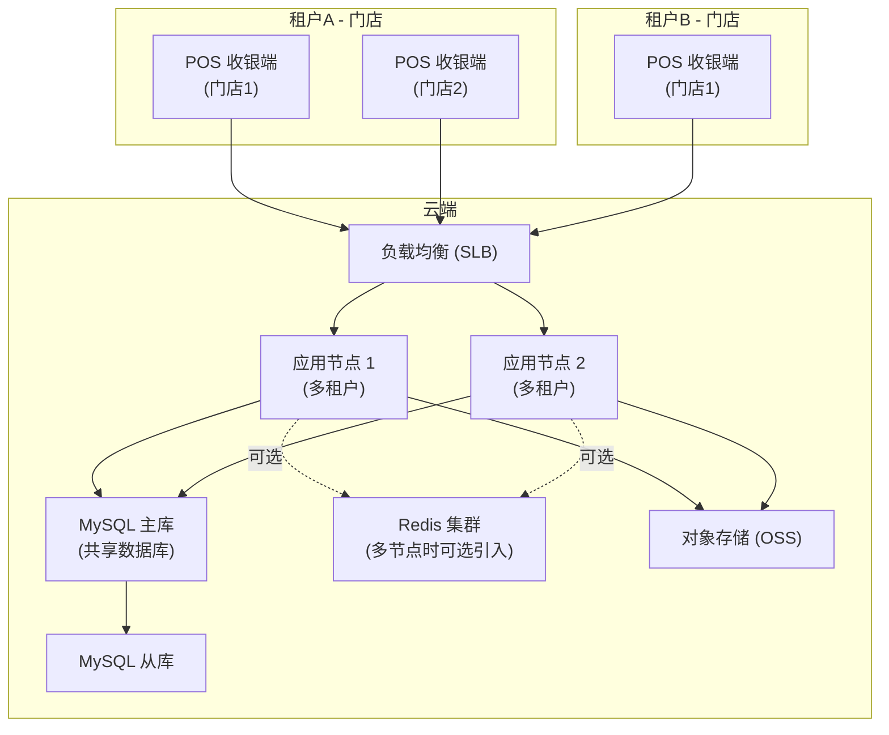
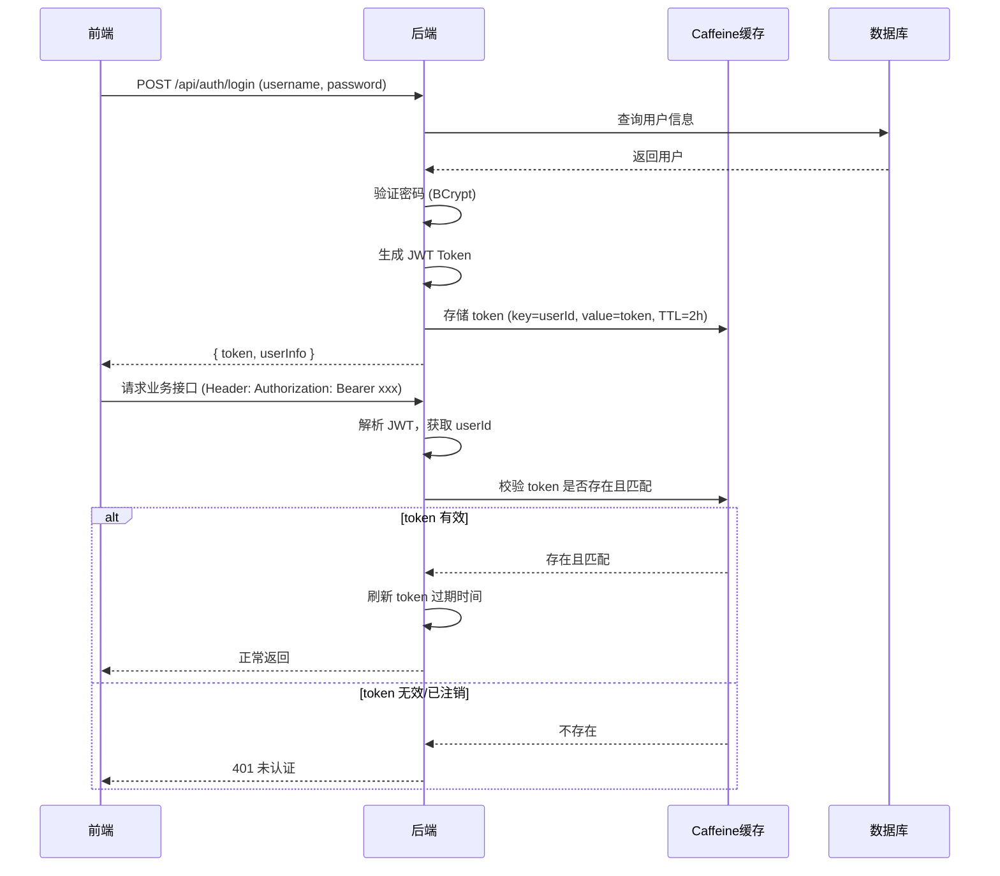
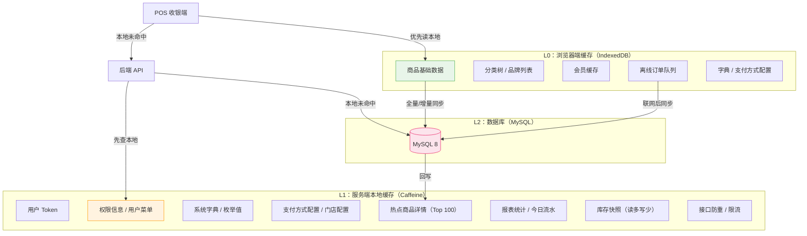
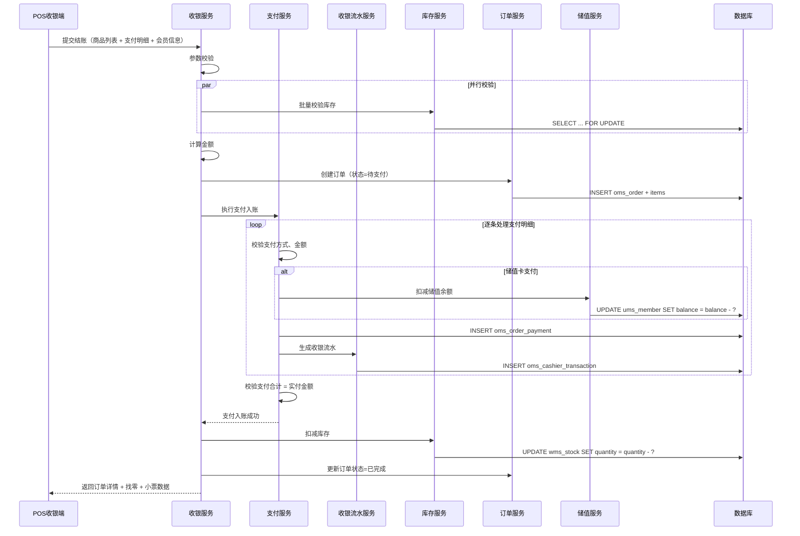

# 超市收银/出入库系统 - 技术架构设计方案

> **版本：** v1.7（文件上传模块设计）  
> **日期：** 2026-09-01  
> **状态：** 待评审
>
> **变更说明（v1.6 → v1.7）：**
> - 新增**文件上传模块设计**：统一文件上传接口、目录规范、多业务分类存储
> - 新增**上传目录规范**：项目根目录 `uploads/` 按业务分子目录，.gitignore 排除
> - 新增**前端上传 API**：`uploadImage(file, category)` 支持按类别上传
> - 新增**静态资源映射**：`/api/v1/upload/file/**` 映射到 uploads 目录
> - 修复**商品图片上传**：base64 改为文件上传，解决 image 列超长问题
>
> **变更说明（v1.5 → v1.6）：**
> - 新增**多租户模块设计**：支持SaaS多租户架构
> - 新增**租户管理模块**：租户CRUD、门店管理、租户配置
> - 新增**租户上下文管理**：ThreadLocal存储租户信息、拦截器自动提取
> - 新增**数据隔离方案**：MyBatis-Plus租户拦截器、三级隔离策略
> - 新增**租户安全设计**：数据隔离验证、越权访问防护
> - 新增**多租户演进路径**：从单店到微服务的演进方案
>
> **变更说明（v1.4 → v1.5）：**
> - 新增**项目根目录结构**，明确前后端分离工程组织
> - 新增**代码设计流程与规范**：前端先行开发流程、单模块开发步骤、前后端联调规范、代码提交规范、开发里程碑排期
> - 新增**后端完整目录结构**：Maven 单模块 + 按业务域分包，含所有层级
> - 新增**后端工程化方案**：Maven 依赖管理、配置文件、代码规范、构建部署
> - 新增**本地开发环境配置**：Maven 本地路径 `D:\SoftWare\CodeTools\apache-maven-3.9.3`、JDK 本地路径 `D:\SoftWare\CodeTools\jdk-17.0.5`，含 IDEA 配置与验证命令
> - 新增**后端模块内部结构**：每个业务模块的 Controller / Service / Mapper / Entity / DTO / VO 详细定义
> - 新增**数据库脚本目录**与初始化方案
> - 新增**Docker 部署目录结构**与编排配置
> - 新增**前后端联调规范**：接口约定、环境配置、代理配置
> - 优化**系统整体架构图**，补充前后端分离交互细节
> - 保留 v1.4 全部内容：轻量三层缓存体系、浏览器端 IndexedDB 缓存、前端工程化方案、记账式支付、收银流水等
>
> **变更说明（v1.3 → v1.4）：**
> - 缓存方案升级为轻量三层缓存体系
> - 新增浏览器端缓存完整设计
> - 前端章节聚焦最终技术栈 + 工程化方案
>
> **变更说明（v1.2 → v1.3）：**
> - 缓存方案确定为 Caffeine 本地进程缓存 + 数据库索引优化
> - 报表性能优化补充日支付预聚合表设计

---

## 目录

1. [项目整体结构](#1-项目整体结构)
2. [代码设计流程与规范](#2-代码设计流程与规范)
3. [前端技术栈与工程化](#3-前端技术栈与工程化)
4. [后端技术栈与工程化](#4-后端技术栈与工程化)
5. [系统整体架构](#5-系统整体架构)
6. [数据库设计](#6-数据库设计)
7. [后端技术架构](#7-后端技术架构)
8. [接口设计示例](#8-接口设计示例)
9. [非功能性技术方案](#9-非功能性技术方案)
10. [多租户模块设计](#10-多租户模块设计)

---

## 1. 项目整体结构

### 1.1 项目根目录

本项目采用**前后端分离**架构，前端和后端作为独立工程维护，通过 RESTful API 交互。

```
supermarket-erp/
├── frontend/                      # 前端工程（Vue 3 + Vite）
├── backend/                       # 后端工程（Spring Boot）
├── uploads/                       # 文件上传目录（按业务分子目录）
│   ├── product/                   #   商品图片
│   ├── user/                      #   用户头像
│   ├── receipt/                   #   小票图片
│   └── ...                        #   其他业务扩展
├── docker/                        # Docker 部署配置
│   ├── docker-compose.yml
│   ├── nginx/
│   │   ├── nginx.conf             # Nginx 主配置
│   │   ├── conf.d/
│   │   │   ├── admin.conf         # 管理后台反向代理
│   │   │   └── pos.conf           # POS 端反向代理
│   │   └── ssl/                   # HTTPS 证书
│   ├── Dockerfile.frontend        # 前端镜像构建
│   └── Dockerfile.backend         # 后端镜像构建
├── docs/                          # 项目文档
│   ├── 技术架构设计方案-v1.5.md
│   ├── 数据库设计文档.md
│   └── 接口文档.md
├── scripts/                       # 运维脚本
│   ├── init-db.sql                # 数据库初始化脚本
│   ├── deploy.sh                  # 部署脚本
│   └── backup.sh                  # 备份脚本
├── .gitignore
├── README.md
└── Makefile                       # 快捷命令（可选）
```

### 1.2 前后端分离交互规范

**通信协议：** HTTPS + RESTful API

**交互流程：**

```
┌──────────────┐     HTTP/HTTPS      ┌──────────────┐     JDBC      ┌──────────────┐
│              │ ──────────────────> │              │ ────────────> │              │
│  前端 (Vue3) │ <────────────────── │  Nginx       │               │  MySQL 8     │
│  浏览器运行  │     JSON 响应       │  反向代理    │               │              │
│              │                     │  静态资源    │               └──────────────┘
└──────────────┘                     └──────┬───────┘
                                            │
                                            │ 反向代理 /api
                                            ▼
                                     ┌──────────────┐
                                     │              │
                                     │  后端        │
                                     │  Spring Boot │
                                     │  单体应用    │
                                     │              │
                                     └──────────────┘
```

**接口约定：**

| 约定项 | 规范 |
|--------|------|
| URL 前缀 | `/api/v1/` |
| 认证方式 | Bearer Token（JWT），放在 `Authorization` Header |
| 请求格式 | `application/json`，UTF-8 编码 |
| 响应格式 | 统一 `Result<T>` 包装 |
| 时间格式 | `yyyy-MM-dd HH:mm:ss`（字符串）或毫秒时间戳 |
| 金额格式 | 数字类型，保留 2 位小数，单位：元 |
| 分页参数 | `page`（从 1 开始）、`pageSize`（默认 20） |
| 排序参数 | `sortField`、`sortOrder`（asc/desc） |
| 请求 ID | 客户端生成 `requestId`，用于幂等防重 |
| 跨域配置 | 后端配置 CORS，仅允许指定前端域名 |

---

## 2. 代码设计流程与规范

### 2.1 总体开发流程

本项目采用**前端先行、接口驱动、前后端并行**的开发模式。遵循"页面原型 → 接口定义 → 前端开发 → 后端开发 → 联调测试"的流程，确保前后端高效协作。

**开发流程总览：**

```
┌─────────────────────────────────────────────────────────────────────┐
│                        代码设计全流程                                │
├─────────────────────────────────────────────────────────────────────┤
│                                                                     │
│  Phase 1: 基础搭建          Phase 2: 核心功能        Phase 3: 完善   │
│  ┌──────────────────┐      ┌──────────────────┐    ┌─────────────┐ │
│  │ 1. 项目初始化     │      │ 4. 收银模块       │    │ 7. 报表模块  │ │
│  │ 2. 基础框架搭建   │ ──>  │ 5. 库存模块       │ ──>│ 8. 系统管理  │ │
│  │ 3. 公共模块开发   │      │ 6. 会员模块       │    │ 9. 优化完善  │ │
│  └──────────────────┘      └──────────────────┘    └─────────────┘ │
│                                                                     │
│  每个模块内部开发顺序:                                               │
│  数据库建表 → Entity/DTO/VO → Mapper → Service → Controller → 前端  │
│                                                                     │
└─────────────────────────────────────────────────────────────────────┘
```

### 2.2 Phase 1：基础搭建（优先级最高）

**目标：** 搭建前后端工程骨架，跑通登录流程，为后续开发打基础。

| 步骤 | 工作内容 | 前端/后端 | 产出物 |
|------|----------|-----------|--------|
| 1.1 | 创建前端工程（Vue 3 + Vite + TypeScript） | 前端 | `frontend/` 目录骨架 |
| 1.2 | 创建后端工程（Spring Boot + MyBatis-Plus） | 后端 | `backend/` 目录骨架 + pom.xml |
| 1.3 | 创建数据库，执行建表 SQL | 后端 | 数据库初始化脚本 |
| 1.4 | 后端公共模块开发（Result、全局异常、JWT、CORS） | 后端 | `common/` 模块 |
| 1.5 | 前端公共组件开发（Axios 封装、路由、Store、布局） | 前端 | `api/request.ts`、`router/`、`stores/`、`layouts/` |
| 1.6 | 登录功能（前后端联调） | 前后端 | 登录页 + JWT 认证流程 |
| 1.7 | Nginx 配置，前后端跑通 | 部署 | `docker/nginx/` 配置 |

**验收标准：** 启动前端 + 后端 + MySQL，能完成登录、跳转到主页、退出。

### 2.3 Phase 2：核心功能开发

**目标：** 按模块逐个开发核心业务功能，每个模块走完"建表 → 后端 → 前端 → 联调"全流程。

**模块开发顺序（按业务依赖关系排列）：**

| 顺序 | 模块 | 开发内容 | 依赖 |
|------|------|----------|------|
| ① | **商品模块** | 商品 CRUD、分类管理、商品搜索 | 无（基础数据） |
| ② | **库存模块** | 入库单、出库单、库存查询 | 商品模块 |
| ③ | **订单模块** | 订单查询、订单详情、取消订单 | 商品模块 |
| ④ | **收银模块** | 收银结账、记账式支付、组合支付 | 商品+库存+订单+会员 |
| ⑤ | **会员模块** | 会员 CRUD、储值、积分 | 无 |
| ⑥ | **支付模块** | 支付方式配置、支付记录、收银流水 | 订单模块 |
| ⑦ | **报表模块** | 日报、月报、经营看板 | 订单+支付+会员 |
| ⑧ | **系统管理** | 用户、角色、权限、字典、供应商 | 无 |

**单个模块的开发步骤（以商品模块为例）：**

```
┌─────────────────────────────────────────────────────────────┐
│                   单模块开发流程                              │
├─────────────────────────────────────────────────────────────┤
│                                                             │
│  Step 1: 数据库                                              │
│  └─> 创建数据表（pms_product、pms_category）+ 索引           │
│                                                             │
│  Step 2: 后端 Entity / DTO / VO                              │
│  └─> Product.java、ProductCreateDTO.java、ProductVO.java    │
│                                                             │
│  Step 3: 后端 Mapper                                         │
│  └─> ProductMapper.java + ProductMapper.xml（复杂SQL）       │
│                                                             │
│  Step 4: 后端 Service                                        │
│  └─> IProductService.java + ProductServiceImpl.java         │
│                                                             │
│  Step 5: 后端 Controller                                     │
│  └─> ProductController.java（接口定义 + 参数校验）            │
│                                                             │
│  Step 6: 前端 API 定义                                       │
│  └─> api/product.ts（接口调用封装）                           │
│                                                             │
│  Step 7: 前端类型定义                                        │
│  └─> types/product.ts（TypeScript 类型）                     │
│                                                             │
│  Step 8: 前端页面开发                                        │
│  └─> views/admin/product/ProductList.vue + ProductForm.vue  │
│                                                             │
│  Step 9: 联调测试                                            │
│  └─> 前后端联调，确保接口正常、页面功能完整                    │
│                                                             │
└─────────────────────────────────────────────────────────────┘
```

### 2.4 Phase 3：完善与优化

| 步骤 | 工作内容 | 说明 |
|------|----------|------|
| 3.1 | 报表模块开发 | 日报、月报、经营看板 |
| 3.2 | 系统管理模块 | 用户、角色、权限、字典 |
| 3.3 | POS 端优化 | 收银主界面交互优化、搜索体验、离线模式 |
| 3.4 | 性能优化 | 缓存调优、SQL 优化、前端懒加载 |
| 3.5 | 安全加固 | 接口限流、操作日志、敏感数据加密 |
| 3.6 | Docker 部署 | 容器化部署、Nginx 配置 |
| 3.7 | 文档完善 | 接口文档（Knife4j）、部署文档 |

---

### 2.5 前端页面开发规范

#### 2.5.1 页面开发步骤

每个前端页面的开发必须按以下步骤执行：

```
Step 1: 定义 TypeScript 类型（types/*.ts）
    ↓
Step 2: 定义 API 接口（api/*.ts）
    ↓
Step 3: 开发页面组件（views/**/*.vue）
    ↓
Step 4: 配置路由（router/admin.ts 或 pos.ts）
    ↓
Step 5: 开发/复用业务组件（components/business/*.vue）
    ↓
Step 6: 本地测试 + 联调
```

**禁止事项：**
- 禁止跳过 TypeScript 类型定义直接写页面
- 禁止在页面组件中直接写 HTTP 请求，必须封装到 `api/` 层
- 禁止硬编码（金额、状态码等必须使用常量或枚举）
- 禁止在页面中写大段内联样式，必须使用 Tailwind CSS 类或 scoped style

#### 2.5.2 组件开发规范

**文件组织：**
```
views/admin/product/
├── ProductList.vue        # 商品列表页（主页面）
├── ProductForm.vue        # 商品表单（新增/编辑弹窗或子页面）
└── components/            # 该页面专用子组件（可选）
    └── ProductSearch.vue
```

**组件模板结构（单文件组件 `<script setup lang="ts">`）：**

```vue
<template>
  <!-- 1. 搜索区域 -->
  <div class="search-area">...</div>

  <!-- 2. 操作栏 -->
  <div class="action-bar">...</div>

  <!-- 3. 数据表格 -->
  <AppTable :columns="columns" :data="tableData" />

  <!-- 4. 分页 -->
  <AppPagination v-model:page="query.page" :total="total" />

  <!-- 5. 弹窗/抽屉 -->
  <AppDialog v-model:show="showForm">
    <ProductForm @success="handleSuccess" />
  </AppDialog>
</template>

<script setup lang="ts">
// 1. 导入（按顺序：Vue → 第三方库 → 组件 → API → 类型 → 工具 → Store）
import { ref, reactive, onMounted } from 'vue'
import { useMessage } from 'naive-ui'
import AppTable from '@/components/common/AppTable.vue'
import AppPagination from '@/components/common/AppPagination.vue'
import AppDialog from '@/components/common/AppDialog.vue'
import ProductForm from './components/ProductForm.vue'
import { getProductList, deleteProduct } from '@/api/product'
import type { ProductVO, ProductQueryDTO } from '@/types/product'

// 2. 常量定义
const message = useMessage()

// 3. 响应式状态
const loading = ref(false)
const tableData = ref<ProductVO[]>([])
const total = ref(0)
const query = reactive<ProductQueryDTO>({
  page: 1,
  pageSize: 20,
  keyword: '',
  categoryId: undefined,
  status: 1
})

// 4. 表格列定义
const columns = [/* ... */]

// 5. 方法
async function loadData() {
  loading.value = true
  try {
    const res = await getProductList(query)
    tableData.value = res.list
    total.value = res.total
  } finally {
    loading.value = false
  }
}

function handleDelete(row: ProductVO) {
  // 删除逻辑
}

// 6. 生命周期
onMounted(() => {
  loadData()
})
</script>

<style scoped>
/* 仅写 scoped 样式，优先用 Tailwind */
</style>
```

#### 2.5.3 页面分类与路由对照

| 页面目录 | 路由前缀 | 布局 | 说明 |
|----------|----------|------|------|
| `views/login/` | `/login` | 无（独立页面） | 登录页（支持角色化路由） |
| `views/admin/dashboard/` | `/admin/dashboard` | AdminLayout | 经营看板 |
| `views/admin/product/` | `/admin/product` | AdminLayout | 商品管理（列表、表单、分类） |
| `views/admin/stock/` | `/admin/stock` | AdminLayout | 库存管理（列表、入库、出库、盘点） |
| `views/admin/order/` | `/admin/order` | AdminLayout | 订单管理（列表、详情） |
| `views/admin/member/` | `/admin/member` | AdminLayout | 会员管理（列表、表单、详情） |
| `views/admin/report/` | `/admin/report` | AdminLayout | 报表统计（销售、库存、会员） |
| `views/admin/system/` | `/admin/system` | AdminLayout | 超市管理端系统设置 |
| `views/system/` | `/system` | SystemLayout | 系统管理端（租户开通与管理） |
| `views/system/tenant/` | `/system/tenant` | SystemLayout | 租户管理（列表、表单、详情） |
| `views/system/store/` | `/system/store` | SystemLayout | 门店管理（列表、表单） |
| `views/system/user/` | `/system/user` | SystemLayout | 系统用户管理（支持租户筛选） |
| `views/pos/` | `/pos` | PosLayout | POS 收银端（收银、支付、订单） |

---

### 2.6 后端开发规范

#### 2.6.1 后端开发步骤（单模块）

```
Step 1: 数据库建表（DDL + 索引）
    ↓
Step 2: Entity 实体类（@TableName、@TableId、@TableField）
    ↓
Step 3: DTO / Query 参数对象（@Valid + Jakarta Validation 注解）
    ↓
Step 4: VO 视图对象（脱敏、格式化字段）
    ↓
Step 5: Mapper 接口 + XML（单表用 MyBatis-Plus，复杂 SQL 写 XML）
    ↓
Step 6: Service 接口 + 实现（业务逻辑 + 事务控制 + 缓存）
    ↓
Step 7: Controller（参数校验 + 调用 Service + 返回 Result）
    ↓
Step 8: Knife4j 接口文档注解（@Tag、@Operation、@Parameter）
    ↓
Step 9: 单元测试（Service 层核心逻辑）
    ↓
Step 10: 接口联调
```

#### 2.6.2 Controller 编写规范

```java
@Tag(name = "商品管理")
@RestController
@RequestMapping("/api/v1/products")
@RequiredArgsConstructor
public class ProductController {

    private final IProductService productService;

    @Operation(summary = "商品列表查询")
    @GetMapping
    public Result<PageResult<ProductVO>> list(ProductQueryDTO query) {
        return Result.success(productService.listProducts(query));
    }

    @Operation(summary = "商品详情")
    @GetMapping("/{id}")
    public Result<ProductVO> detail(@PathVariable Long id) {
        return Result.success(productService.getProductDetail(id));
    }

    @Operation(summary = "新增商品")
    @PostMapping
    public Result<Long> create(@Valid @RequestBody ProductCreateDTO dto) {
        return Result.success(productService.createProduct(dto));
    }

    @Operation(summary = "修改商品")
    @PutMapping("/{id}")
    public Result<Void> update(@PathVariable Long id,
                               @Valid @RequestBody ProductUpdateDTO dto) {
        productService.updateProduct(id, dto);
        return Result.success();
    }

    @Operation(summary = "删除商品")
    @DeleteMapping("/{id}")
    @PreAuthorize("hasRole('ADMIN')")
    public Result<Void> delete(@PathVariable Long id) {
        productService.deleteProduct(id);
        return Result.success();
    }
}
```

#### 2.6.3 Service 编写规范

```java
public interface IProductService {

    PageResult<ProductVO> listProducts(ProductQueryDTO query);

    ProductVO getProductDetail(Long id);

    Long createProduct(ProductCreateDTO dto);

    void updateProduct(Long id, ProductUpdateDTO dto);

    void deleteProduct(Long id);
}
```

```java
@Service
@RequiredArgsConstructor
@Slf4j
public class ProductServiceImpl implements IProductService {

    private final ProductMapper productMapper;

    @Override
    @Transactional(rollbackFor = Exception.class)
    public Long createProduct(ProductCreateDTO dto) {
        // 1. 校验编号唯一性
        // 2. 构建 Entity
        // 3. 插入数据库
        // 4. 清除缓存
        // 5. 记录操作日志
        // 6. 返回 ID
    }
}
```

---

### 2.7 前后端联调规范

#### 2.7.1 联调前提

| 前提条件 | 说明 |
|----------|------|
| 接口文档已定义 | 后端 Controller + Knife4j 注解完成 |
| 请求/响应格式已约定 | 统一 Result 包装、分页格式 |
| 前端 API 层已封装 | `api/*.ts` 中定义好接口调用方法 |
| 本地环境已搭建 | 前端 `npm run dev` + 后端 `mvn spring-boot:run` + MySQL 运行中 |

#### 2.7.2 本地联调配置

**前端 Vite 代理配置（`vite.config.ts`）：**

```typescript
export default defineConfig({
  server: {
    port: 3000,
    proxy: {
      '/api': {
        target: 'http://localhost:8080',
        changeOrigin: true
      }
    }
  }
})
```

**联调访问地址：**

| 服务 | 地址 | 说明 |
|------|------|------|
| 超市管理端前端 | `http://localhost:3000/admin/` | Vite 开发服务器 |
| 系统管理端前端 | `http://localhost:3000/system/` | Vite 开发服务器（租户管理） |
| POS 收银端前端 | `http://localhost:3000/pos/` | Vite 开发服务器 |
| 后端 API | `http://localhost:8080/api/v1/` | Spring Boot |
| Knife4j 文档 | `http://localhost:8080/doc.html` | 接口在线调试 |

#### 2.7.3 联调检查清单

- [ ] 前端请求能正确发送到后端（网络面板无 CORS 错误）
- [ ] 后端能正确接收参数并返回 Result 格式
- [ ] 前端能正确解析响应并渲染页面
- [ ] 分页查询正常（翻页、每页条数切换）
- [ ] 新增/编辑表单提交正常（参数校验、成功提示）
- [ ] 删除功能正常（二次确认、列表刷新）
- [ ] 异常情况能正确展示错误提示（400/401/403/500）
- [ ] Token 过期后自动跳转登录页

---

### 2.8 代码提交规范

**分支策略：**

```
main          ← 生产分支，只接受合并
  └── dev     ← 开发主分支
       ├── feature/product  ← 功能分支：商品模块
       ├── feature/stock    ← 功能分支：库存模块
       ├── feature/pos      ← 功能分支：收银模块
       └── fix/xxx          ← 修复分支
```

**Git 提交信息格式（Conventional Commits）：**

```
<type>(<scope>): <subject>

type:    feat / fix / docs / style / refactor / test / chore
scope:   product / stock / order / pos / member / report / system
subject: 简短描述，不超过 50 字符
```

**示例：**
```
feat(product): 新增商品列表查询接口
fix(pos): 修复组合支付金额校验错误
docs(api): 补充收银结账接口文档
refactor(order): 重构订单创建逻辑，拆分支付处理
```

**每次提交必须：**
- 代码能编译通过（后端 `mvn compile`、前端 `npm run build` 不报错）
- 不提交敏感信息（密码、密钥、Token）
- 不提交 `target/`、`node_modules/`、`.env.*` 等构建产物和配置文件

---

### 2.9 开发里程碑与排期建议

| 阶段 | 模块 | 预计工期 | 产出 |
|------|------|----------|------|
| **M1: 基础搭建** | 项目初始化 + 登录 + 公共模块 | 3-5 天 | 前后端骨架 + 登录功能 |
| **M2: 商品管理** | 商品 CRUD + 分类管理 | 3-4 天 | 商品管理全流程 |
| **M3: 库存管理** | 入库 + 出库 + 库存查询 | 4-5 天 | 库存管理全流程 |
| **M4: 会员管理** | 会员 CRUD + 储值 + 积分 | 3-4 天 | 会员管理全流程 |
| **M5: 收银核心** | 收银结账 + 支付 + 流水 | 5-7 天 | **核心功能闭环** |
| **M6: 订单管理** | 订单查询 + 详情 + 取消 | 2-3 天 | 订单管理 |
| **M7: 报表统计** | 日报 + 月报 + 经营看板 | 3-4 天 | 报表可视化 |
| **M8: 系统管理** | 用户 + 角色 + 权限 + 字典 | 3-4 天 | 后台管理完善 |
| **M9: POS 优化** | 收银界面优化 + 离线模式 | 3-5 天 | POS 端体验优化 |
| **M10: 上线部署** | Docker 部署 + Nginx + 测试 | 2-3 天 | 生产环境上线 |

**总计预估：** 31-44 个工作日（1 人全栈），20-30 个工作日（2 人前后端分工）

---

## 3. 前端技术栈与工程化

### 3.1 技术栈总览

**最终确定技术栈：Vue 3.6 + Vite 6 + TypeScript + Naive UI + Tailwind CSS**

| 分类 | 技术选型 | 版本 | 说明 |
|------|----------|------|------|
| **核心框架** | Vue | 3.6.x | 组合式 API + Vapor Mode 按需开启 |
| **构建工具** | Vite | 6.x | Rolldown 引擎（Rust 实现），热更新极速 |
| **语言** | TypeScript | 5.x | strict 模式全开，类型安全 |
| **UI 组件库** | Naive UI | 最新 | TypeScript 原生，主题定制能力极强 |
| **CSS 方案** | Tailwind CSS | 4.x | 原子类 CSS，配合 Naive UI 双轨制 |
| **状态管理** | Pinia | 最新 | Vue 3 官方推荐，Devtools 支持 |
| **路由** | Vue Router | 4.x | 动态路由 + 权限控制 |
| **HTTP 客户端** | Axios | 最新 | 拦截器统一处理 token、错误、loading |
| **图标** | Phosphor Icons | 最新 | 现代风格图标库，粗细可调 |
| **动画** | @vueuse/motion | 最新 | 声明式动画，微交互必备 |
| **本地数据库** | IndexedDB (Dexie.js) | 最新 | POS 端本地商品缓存与离线订单 |
| **拼音搜索** | pinyin-pro | 最新 | 前端拼音索引与搜索 |
| **代码规范** | ESLint + Prettier + Stylelint | - | 统一代码风格 |
| **POS 打包（可选）** | Electron + electron-builder | 最新 | 桌面端打包，全屏独占体验 |

### 3.2 前端目录结构

```
frontend/
├── public/                        # 静态资源（不经过构建）
│   ├── favicon.ico
│   └── robots.txt
├── src/
│   ├── api/                       # API 请求封装
│   │   ├── request.ts             # Axios 实例 + 拦截器
│   │   ├── auth.ts                # 认证相关接口
│   │   ├── product.ts             # 商品相关接口
│   │   ├── order.ts               # 订单相关接口
│   │   ├── pos.ts                 # 收银相关接口
│   │   ├── member.ts              # 会员相关接口
│   │   ├── stock.ts               # 库存相关接口
│   │   ├── system.ts              # 系统管理接口
│   │   └── tenant.ts              # 租户管理接口（多租户版）
│   ├── assets/                    # 静态资源（经过构建）
│   │   ├── images/
│   │   ├── styles/
│   │   │   ├── index.css          # Tailwind 入口 + 全局样式
│   │   │   └── variables.css      # CSS 变量（主题色、间距等）
│   │   └── fonts/
│   ├── components/                # 全局公共组件
│   │   ├── common/                # 通用组件
│   │   │   ├── AppTable.vue       # 通用表格（封装 Naive UI DataTable）
│   │   │   ├── AppForm.vue        # 通用表单
│   │   │   ├── AppDialog.vue      # 通用弹窗
│   │   │   ├── AppSearch.vue      # 通用搜索栏
│   │   │   ├── AppPagination.vue  # 分页组件
│   │   │   └── AppBreadcrumb.vue  # 面包屑
│   │   └── business/              # 业务组件
│   │       ├── ProductCard.vue    # 商品卡片（POS 端）
│   │       ├── PaymentPanel.vue   # 支付面板
│   │       ├── CartPanel.vue      # 购物车面板
│   │       ├── CategoryTree.vue   # 分类树
│   │       ├── MemberSearch.vue   # 会员搜索
│   │       ├── ReceiptPreview.vue # 小票预览
│   │       └── OfflineIndicator.vue # 离线状态指示
│   ├── composables/               # 组合式函数（复用逻辑）
│   │   ├── usePos.ts              # 收银相关逻辑
│   │   ├── useSearch.ts           # 搜索相关逻辑
│   │   ├── useOffline.ts          # 离线模式逻辑
│   │   ├── useAuth.ts             # 认证相关
│   │   ├── usePagination.ts       # 分页逻辑
│   │   └── useLoading.ts          # 加载状态
│   ├── db/                        # IndexedDB 封装（Dexie.js）
│   │   ├── index.ts               # Dexie 数据库实例
│   │   ├── product.ts             # 商品表操作
│   │   ├── category.ts            # 分类表操作
│   │   ├── member.ts              # 会员缓存表
│   │   ├── offlineOrder.ts        # 离线订单队列
│   │   └── sync.ts                # 数据同步逻辑
│   ├── layouts/                   # 布局组件
│   │   ├── AdminLayout.vue        # 管理后台布局（侧边栏+顶栏+内容区）
│   │   ├── PosLayout.vue          # POS 收银端布局（全屏收银）
│   │   └── SystemLayout.vue       # 系统管理后台布局（租户管理专用）
│   ├── router/                    # 路由配置
│   │   ├── index.ts               # 路由实例 + 导航守卫（统一管理所有路由）
│   │   ├── admin.ts               # 管理后台路由表（备用）
│   │   └── pos.ts                 # POS 端路由表（备用）
│   ├── stores/                    # Pinia 状态管理
│   │   ├── index.ts               # store 注册
│   │   ├── user.ts                # 用户信息、权限、token
│   │   ├── app.ts                 # 应用全局状态（主题、语言）
│   │   ├── pos.ts                 # 收银状态（购物车、当前订单）
│   │   └── cache.ts               # 本地缓存状态（数据版本、同步状态）
│   ├── types/                     # TypeScript 类型定义
│   │   ├── index.ts               # 通用类型（Result、PageResult、UserInfo 等）
│   │   ├── product.ts             # 商品相关类型
│   │   ├── order.ts               # 订单相关类型
│   │   ├── member.ts              # 会员相关类型
│   │   ├── stock.ts               # 库存相关类型
│   │   └── tenant.ts              # 租户相关类型（Tenant、Store、TenantConfig 等）
│   ├── utils/                     # 工具函数
│   │   ├── index.ts               # 通用工具
│   │   ├── storage.ts             # 本地存储封装（localStorage / IndexedDB）
│   │   ├── format.ts              # 格式化（金额、日期等）
│   │   ├── validate.ts            # 校验函数
│   │   └── crypto.ts              # 加密工具（AES 等）
│   ├── views/                     # 页面组件
│   │   ├── login/                 # 登录页面
│   │   │   └── LoginPage.vue      # 登录页（支持角色化路由）
│   │   ├── admin/                 # 超市管理端页面
│   │   │   ├── dashboard/         # 经营看板
│   │   │   │   └── Dashboard.vue
│   │   │   ├── product/           # 商品管理
│   │   │   │   ├── ProductList.vue
│   │   │   │   ├── ProductForm.vue
│   │   │   │   └── ProductCategory.vue
│   │   │   ├── stock/             # 库存管理
│   │   │   │   ├── StockList.vue
│   │   │   │   ├── StockInbound.vue
│   │   │   │   ├── StockOutbound.vue
│   │   │   │   └── StockCheck.vue
│   │   │   ├── order/             # 订单管理
│   │   │   │   ├── OrderList.vue
│   │   │   │   └── OrderDetail.vue
│   │   │   ├── member/            # 会员管理
│   │   │   │   ├── MemberList.vue
│   │   │   │   ├── MemberForm.vue
│   │   │   │   └── MemberDetail.vue
│   │   │   ├── report/            # 报表统计
│   │   │   │   ├── SalesReport.vue
│   │   │   │   ├── ReportStock.vue
│   │   │   │   └── ReportMember.vue
│   │   │   └── system/            # 超市管理端系统设置
│   │   │       ├── SystemSettings.vue
│   │   │       ├── SystemUsers.vue
│   │   │       └── SystemLogs.vue
│   │   ├── system/                # 系统管理端页面（租户开通与管理）
│   │   │   ├── SystemDashboard.vue    # 系统概览（租户统计、快捷操作）
│   │   │   ├── SystemSettings.vue     # 系统设置（安全、邮件、存储、缓存、租户）
│   │   │   ├── SystemLogs.vue         # 操作日志（租户管理、门店管理等）
│   │   │   ├── tenant/                # 租户管理
│   │   │   │   ├── TenantList.vue     # 租户列表（搜索、新增、启用/禁用）
│   │   │   │   ├── TenantForm.vue     # 租户表单（新增/编辑租户）
│   │   │   │   └── TenantDetail.vue   # 租户详情（基本信息、门店列表、租户配置）
│   │   │   ├── store/                 # 门店管理
│   │   │   │   ├── StoreList.vue      # 门店列表（搜索、新增、状态管理）
│   │   │   │   └── StoreForm.vue      # 门店表单（新增/编辑门店）
│   │   │   └── user/                  # 系统用户管理
│   │   │       └── UserList.vue       # 用户列表（支持租户筛选、系统/租户用户）
│   │   └── pos/                   # POS 收银端页面
│   │       ├── Cashier.vue        # 收银主界面（商品搜索+购物车+支付）
│   │       ├── Payment.vue        # 支付界面（选择支付方式+金额录入）
│   │       └── OrderList.vue      # 历史订单查询
│   ├── App.vue                    # 根组件
│   └── main.ts                    # 应用入口
├── index.html                     # HTML 入口
├── package.json                   # 依赖管理
├── vite.config.ts                 # Vite 配置
├── tsconfig.json                  # TypeScript 配置
├── tailwind.config.js             # Tailwind CSS 配置
├── naive-ui-theme-overrides.ts    # Naive UI 主题覆盖
├── .eslintrc.cjs                  # ESLint 配置
├── .prettierrc                    # Prettier 配置
├── .stylelintrc.json              # Stylelint 配置
└── .env.*                         # 环境变量（development / staging / production）
```

#### 3.2.1 三端架构说明

本系统采用**三端分离**架构，每个端有独立的布局和路由：

| 端 | 路径前缀 | 布局组件 | 用途 | 目标用户 |
|----|----------|----------|------|----------|
| **POS收银端** | `/pos/*` | PosLayout | 收银操作 | 收银员 |
| **超市管理端** | `/admin/*` | AdminLayout | 业务管理 | 超市管理人员 |
| **系统管理端** | `/system/*` | SystemLayout | 租户开通与管理 | 运维人员 |

#### 3.2.2 页面模块对照表

| 模块 | 路由路径 | 页面文件 | 说明 |
|------|----------|----------|------|
| **登录** | `/login` | LoginPage.vue | 支持角色化路由（admin→/admin, sysadmin→/system） |
| **经营看板** | `/admin/dashboard` | Dashboard.vue | 销售统计、图表、快捷操作 |
| **商品管理** | `/admin/product/*` | ProductList.vue, ProductForm.vue, ProductCategory.vue | 商品CRUD、分类管理（树形结构） |
| **库存管理** | `/admin/stock/*` | StockList.vue, StockInbound.vue, StockOutbound.vue, StockCheck.vue | 库存查询、入库、出库、盘点 |
| **订单管理** | `/admin/order/*` | OrderList.vue, OrderDetail.vue | 订单查询、详情、退款 |
| **会员管理** | `/admin/member/*` | MemberList.vue, MemberForm.vue, MemberDetail.vue | 会员CRUD、储值、积分、详情 |
| **报表统计** | `/admin/report/*` | SalesReport.vue, ReportStock.vue, ReportMember.vue | 销售报表、库存报表、会员报表 |
| **超市系统设置** | `/admin/system/*` | SystemSettings.vue, SystemUsers.vue, SystemLogs.vue | 参数设置、用户管理、操作日志 |
| **系统概览** | `/system/dashboard` | SystemDashboard.vue | 租户统计、快捷操作、最近开通 |
| **租户管理** | `/system/tenant/*` | TenantList.vue, TenantForm.vue, TenantDetail.vue | 租户CRUD、详情、配置 |
| **门店管理** | `/system/store/*` | StoreList.vue, StoreForm.vue | 门店CRUD、状态管理 |
| **系统用户** | `/system/user/*` | UserList.vue | 系统用户+租户用户、租户筛选 |
| **系统操作日志** | `/system/logs` | SystemLogs.vue | 租户管理、门店管理等操作日志 |
| **系统设置** | `/system/settings` | SystemSettings.vue | 安全、邮件、存储、缓存、租户配置 |
| **POS收银** | `/pos/cashier` | Cashier.vue | 商品搜索+购物车+会员+支付 |
| **POS支付** | `/pos/payment` | Payment.vue | 支付方式选择+金额录入+积分预估 |
| **POS订单** | `/pos/orderList` | OrderList.vue | 今日订单查询、退款 |

#### 3.2.3 登录角色路由

| 登录账号 | 密码 | 角色 | 跳转路径 |
|----------|------|------|----------|
| admin | admin123 | admin（超市管理员） | `/admin/dashboard` |
| sysadmin | admin123 | system_admin（系统管理员） | `/system/dashboard` |

### 3.3 前端工程化详情

#### 2.3.1 状态管理（Pinia）

**Store 划分原则：** 按业务域划分，避免单一 store 过于臃肿。

| Store | 职责 | 核心状态 |
|-------|------|----------|
| **userStore** | 用户认证与权限 | 用户信息、token、角色、权限菜单 |
| **appStore** | 应用全局状态 | 主题（亮/暗）、语言、侧边栏状态、加载状态 |
| **posStore** | 收银状态（POS 端专用） | 购物车商品列表、当前会员、优惠信息、挂单列表、今日订单统计 |
| **cacheStore** | 本地缓存状态 | 数据版本号、最后同步时间、同步状态、离线模式标志 |

**持久化策略：**
- userStore：token 持久化到 localStorage
- appStore：主题、语言偏好持久化到 localStorage
- posStore：购物车、挂单持久化到 IndexedDB（防止刷新丢失）
- cacheStore：同步版本号持久化到 IndexedDB

#### 2.3.2 路由管理（Vue Router）

**路由模式：** History 模式（HTML5 History API）

**路由守卫：**
1. **全局前置守卫**：token 校验、权限校验、动态路由注入
2. **全局后置钩子**：页面标题更新、埋点上报
3. **路由级元信息**：`meta.title`、`meta.roles`、`meta.keepAlive`、`meta.layout`

**动态路由：**
- 登录后根据用户角色/权限动态加载路由表
- POS 端与管理后台使用不同的路由配置和布局
- 404 页面通配符放在最后

#### 2.3.3 请求封装（Axios）

**请求拦截器：**
- 自动注入 Authorization Header（Bearer Token）
- 自动注入租户头（X-Tenant-Id、X-Store-Id）
- 请求 ID 生成（用于幂等和链路追踪）
- 请求防抖与重复请求取消
- 全局 loading 状态管理

**响应拦截器：**
- 统一错误处理（401 跳转登录、403 无权限提示、500 系统错误）
- 自动刷新 token（检测到 token 即将过期时静默刷新）
- 响应数据解构（直接返回 `data` 字段）
- 离线模式检测（网络错误时切换离线模式）

**封装方法：**
```typescript
// GET 请求
export function get<T>(url: string, params?: any): Promise<T>

// POST 请求
export function post<T>(url: string, data?: any): Promise<T>

// PUT 请求
export function put<T>(url: string, data?: any): Promise<T>

// DELETE 请求
export function del<T>(url: string): Promise<T>

// 上传文件
export function upload<T>(url: string, file: File): Promise<T>
```

#### 2.3.4 代码规范

| 规范工具 | 作用 | 配置 |
|----------|------|------|
| **ESLint** | JavaScript/TypeScript 代码质量检查 | eslint-plugin-vue + @typescript-eslint |
| **Prettier** | 代码格式化 | 2 空格缩进、单引号、无分号 |
| **Stylelint** | CSS/SCSS 样式检查 | tailwindcss 兼容配置 |
| **husky + lint-staged** | Git 提交前检查 | pre-commit 钩子自动格式化 |
| **commitlint** | Git 提交信息规范 | Conventional Commits 规范 |
| **TypeScript strict** | 类型严格检查 | strict: true，noImplicitAny 等 |

**命名规范：**
- 组件：PascalCase（`ProductCard.vue`）
- 组合式函数：camelCase，use 前缀（`useSearch.ts`）
- Store：camelCase，Store 后缀（`userStore`）
- 常量：UPPER_SNAKE_CASE（`MAX_RETRY_COUNT`）
- 文件名：组件 PascalCase，其余 camelCase

#### 2.3.5 构建与部署

**构建优化：**
- **代码分割**：按路由懒加载，首屏加载更快
- **按需引入**：Naive UI 组件按需引入，Tree Shaking
- **资源压缩**：Gzip / Brotli 压缩
- **CDN 加速**：静态资源上传 CDN
- **PWA 支持**：Service Worker 缓存静态资源，支持离线访问应用壳

**环境配置：**

| 环境 | 文件 | API 地址 | 说明 |
|------|------|----------|------|
| 开发 | `.env.development` | `http://localhost:8080/api` | 本地开发 |
| 测试 | `.env.staging` | `https://staging-api.xxx.com/api` | 测试环境 |
| 生产 | `.env.production` | `https://api.xxx.com/api` | 生产环境 |

### 3.4 POS 端与管理后台技术差异

**统一技术栈，差异化构建与配置：**

| 维度 | 管理后台 | POS 收银端 |
|------|----------|------------|
| **布局风格** | 标准后台布局（侧边栏 + 顶栏 + 内容区） | 全屏收银布局（商品区 + 购物车区 + 支付区） |
| **主题模式** | 浅色为主，数据密度中等 | 深色模式优先，大按钮大字体，触控友好 |
| **状态管理** | 以服务端状态为主，本地状态较轻 | 本地状态重（IndexedDB 缓存、购物车、离线订单） |
| **路由模式** | 多页面路由，权限控制细 | 少页面路由，主要在单页内切换视图 |
| **网络依赖** | 完全在线，断网不可用 | 支持离线模式，断网可继续收银 |
| **性能优化重点** | 大数据表格渲染、报表图表 | 搜索响应速度、本地缓存同步 |
| **打包方式** | 标准 Web 构建 | Web 构建为主，Electron 打包可选 |
| **设备适配** | 桌面端为主，响应式兼容平板 | 触控屏优先，大按钮大间距 |

**共享资源：**
- 组件库、工具函数、类型定义完全复用
- API 请求层、状态管理框架复用
- 代码规范、构建配置统一维护
- 共享比例约 60-70%，差异部分通过不同入口和条件编译隔离

---

## 4. 后端技术栈与工程化

### 4.1 技术栈总览

| 分类 | 技术选型 | 版本 | 说明 |
|------|----------|------|------|
| **核心框架** | Spring Boot | 3.2.x | 基础框架，内嵌 Tomcat |
| **ORM** | MyBatis-Plus | 3.5.x | 持久层框架，单表 CRUD 零 SQL |
| **数据库** | MySQL | 8.0 | 主数据库 |
| **本地缓存** | Caffeine | 最新 | JVM 内缓存（Token、热点数据、字典、报表） |
| **认证** | Spring Security + JWT | - | 权限认证框架 |
| **参数校验** | Jakarta Validation | 3.0 | Bean Validation 注解 |
| **工具库** | Hutool | 5.x | Java 工具类集合 |
| **接口文档** | Knife4j | 4.x | Swagger 增强，自动生成 API 文档 |
| **连接池** | HikariCP | - | 数据库连接池（Spring Boot 默认） |
| **代码规范** | Checkstyle + PMD | - | 代码质量检查 |
| **日志** | Logback + SLF4J | - | 日志框架（Spring Boot 默认） |
| **构建工具** | Maven | 3.9.x | 项目构建与依赖管理 |
| **JDK** | OpenJDK | 17+ | Spring Boot 3.x 要求 JDK 17+ |

### 4.2 本地开发环境配置

> **重要：** 以下为本地开发/测试环境的固定路径，所有开发者必须统一配置，确保构建环境一致性。

| 工具 | 本地路径 | 版本 | 说明 |
|------|----------|------|------|
| **Maven** | `D:\SoftWare\CodeTools\apache-maven-3.9.3` | 3.9.3 | 项目构建工具，本地仓库路径统一 |
| **JDK** | `D:\SoftWare\CodeTools\jdk-17.0.5` | 17.0.5 | Java 运行环境，Spring Boot 3.x 要求 17+ |

**环境变量配置（Windows）：**

```powershell
# 系统环境变量（通过「系统属性 → 环境变量」配置）
JAVA_HOME=D:\SoftWare\CodeTools\jdk-17.0.5
MAVEN_HOME=D:\SoftWare\CodeTools\apache-maven-3.9.3
PATH 中追加: %JAVA_HOME%\bin;%MAVEN_HOME%\bin
```

**IDEA 配置（File → Project Structure）：**

| 配置项 | 路径 |
|--------|------|
| **Project SDK** | `D:\SoftWare\CodeTools\jdk-17.0.5` |
| **Project language level** | 17 |
| **Build → Build Tools → Maven → Maven home path** | `D:\SoftWare\CodeTools\apache-maven-3.9.3` |
| **Build → Build Tools → Maven → User settings file** | `D:\SoftWare\CodeTools\apache-maven-3.9.3\conf\settings.xml` |
| **Build → Build Tools → Maven → Local repository** | `D:\SoftWare\CodeTools\apache-maven-3.9.3\repository`（或自定义） |

**验证命令：**

```bash
# 验证 JDK 版本
java -version
# 预期输出: openjdk version "17.0.5" ...
java version "17.0.15" 2025-04-15 LTS
Java(TM) SE Runtime Environment (build 17.0.15+9-LTS-241)
Java HotSpot(TM) 64-Bit Server VM (build 17.0.15+9-LTS-241, mixed mode, sharing)
# 验证 Maven 版本
mvn -version
# 预期输出: Apache Maven 3.9.3 ...
Apache Maven 3.9.3 (21122926829f1ead511c958d89bd2f672198ae9f)
Maven home: D:\SoftWare\CodeTools\apache-maven-3.9.3
Java version: 17.0.15, vendor: Oracle Corporation, runtime: D:\SoftWare\CodeTools\jdk-17.0.5
Default locale: zh_CN, platform encoding: GBK
OS name: "windows 11", version: "10.0", arch: "amd64", family: "windows"
```

**Maven settings.xml 关键配置（`D:\SoftWare\CodeTools\apache-maven-3.9.3\conf\settings.xml`）：**

```xml
<settings>
  <!-- 本地仓库路径 -->
  <localRepository>D:\SoftWare\CodeTools\apache-maven-3.9.3\repository</localRepository>

  <!-- 阿里云镜像加速（国内开发者必配） -->
  <mirrors>
    <mirror>
      <id>aliyun</id>
      <mirrorOf>central</mirrorOf>
      <name>Aliyun Maven Mirror</name>
      <url>https://maven.aliyun.com/repository/public</url>
    </mirror>
  </mirrors>
</settings>
```

### 4.3 后端目录结构

```
backend/
├── src/
│   ├── main/
│   │   ├── java/com/supermarket/erp/
│   │   │   ├── SupermarketErpApplication.java    # 启动类
│   │   │   │
│   │   │   ├── common/                            # =================== 公共模块 ===================
│   │   │   │   ├── annotation/                    # 自定义注解
│   │   │   │   │   ├── OperationLog.java          # 操作日志注解
│   │   │   │   │   ├── Idempotent.java            # 幂等注解
│   │   │   │   │   └── RateLimit.java             # 限流注解
│   │   │   │   ├── aspect/                        # AOP 切面
│   │   │   │   │   ├── OperationLogAspect.java    # 操作日志切面
│   │   │   │   │   ├── IdempotentAspect.java      # 幂等校验切面
│   │   │   │   │   └── RateLimitAspect.java       # 限流切面
│   │   │   │   ├── config/                        # 全局配置类
│   │   │   │   │   ├── CorsConfig.java            # 跨域配置
│   │   │   │   │   ├── SecurityConfig.java        # Spring Security 配置
│   │   │   │   │   ├── MyBatisPlusConfig.java     # MyBatis-Plus 配置（分页插件等）
│   │   │   │   │   ├── CaffeineCacheConfig.java   # Caffeine 缓存配置
│   │   │   │   │   ├── Knife4jConfig.java         # 接口文档配置
│   │   │   │   │   └── JacksonConfig.java         # JSON 序列化配置
│   │   │   │   ├── controller/                    # 公共 Controller
│   │   │   │   │   └── FileUploadController.java  # 文件上传（图片/附件）
│   │   │   │   ├── constant/                      # 常量定义
│   │   │   │   │   ├── CommonConstant.java        # 通用常量
│   │   │   │   │   ├── PaymentMethod.java         # 支付方式枚举常量
│   │   │   │   │   └── OrderStatus.java           # 订单状态枚举常量
│   │   │   │   ├── enums/                         # 枚举定义
│   │   │   │   │   ├── PaymentMethodEnum.java     # 支付方式枚举
│   │   │   │   │   ├── OrderStatusEnum.java       # 订单状态枚举
│   │   │   │   │   ├── StockTypeEnum.java         # 出入库类型枚举
│   │   │   │   │   └── ResultCodeEnum.java        # 返回码枚举
│   │   │   │   ├── exception/                     # 异常处理
│   │   │   │   │   ├── BusinessException.java     # 业务异常
│   │   │   │   │   └── GlobalExceptionHandler.java # 全局异常处理器
│   │   │   │   ├── result/                        # 统一返回
│   │   │   │   │   ├── Result.java                # 统一返回体
│   │   │   │   │   └── PageResult.java            # 分页返回体
│   │   │   │   ├── security/                      # 安全相关
│   │   │   │   │   ├── JwtTokenProvider.java      # JWT 生成与解析
│   │   │   │   │   ├── JwtAuthenticationFilter.java # JWT 认证过滤器
│   │   │   │   │   ├── UserDetailsServiceImpl.java  # 用户详情服务
│   │   │   │   │   └── LoginUser.java             # 登录用户信息
│   │   │   │   └── util/                          # 工具类
│   │   │   │       ├── SecurityUtil.java          # 获取当前登录用户
│   │   │   │       ├── IdGenerator.java           # ID 生成器（订单号、流水号等）
│   │   │   │       └── BigDecimalUtil.java        # 金额计算工具
│   │   │   │
│   │   │   ├── config/                            # =================== Spring 配置 ===================
│   │   │   │   └── WebMvcConfig.java              # Web MVC 配置（拦截器、静态资源等）
│   │   │   │
│   │   │   └── module/                            # =================== 业务模块 ===================
│   │   │       │
│   │   │       ├── auth/                          # ---------- 认证模块 ----------
│   │   │       │   ├── controller/
│   │   │       │   │   └── AuthController.java    # 登录/登出/刷新Token
│   │   │       │   ├── service/
│   │   │       │   │   ├── IAuthService.java      # 认证服务接口
│   │   │       │   │   └── impl/
│   │   │       │   │       └── AuthServiceImpl.java
│   │   │       │   └── dto/
│   │   │       │       ├── LoginDTO.java          # 登录请求体
│   │   │       │       └── LoginVO.java           # 登录响应体
│   │   │       │
│   │   │       ├── product/                       # ---------- 商品模块 ----------
│   │   │       │   ├── controller/
│   │   │       │   │   ├── ProductController.java # 商品管理（CRUD、上下架、搜索）
│   │   │       │   │   └── CategoryController.java # 分类管理
│   │   │       │   ├── service/
│   │   │       │   │   ├── IProductService.java
│   │   │       │   │   ├── ICategoryService.java
│   │   │       │   │   └── impl/
│   │   │       │   │       ├── ProductServiceImpl.java
│   │   │       │   │       └── CategoryServiceImpl.java
│   │   │       │   ├── mapper/
│   │   │       │   │   ├── ProductMapper.java
│   │   │       │   │   └── CategoryMapper.java
│   │   │       │   ├── entity/
│   │   │       │   │   ├── Product.java           # 商品实体
│   │   │       │   │   └── Category.java          # 分类实体
│   │   │       │   ├── dto/
│   │   │       │   │   ├── ProductCreateDTO.java  # 新增商品
│   │   │       │   │   ├── ProductUpdateDTO.java  # 修改商品
│   │   │       │   │   └── ProductQueryDTO.java   # 商品查询条件
│   │   │       │   └── vo/
│   │   │       │       ├── ProductVO.java         # 商品详情（含库存、分类名）
│   │   │       │       ├── ProductSimpleVO.java   # 商品简要（搜索结果用）
│   │   │       │       └── CategoryVO.java        # 分类树
│   │   │       │
│   │   │       ├── pos/                           # ---------- 收银模块 ----------
│   │   │       │   ├── controller/
│   │   │       │   │   └── PosController.java     # 收银结账、挂单、取单
│   │   │       │   ├── service/
│   │   │       │   │   ├── IPosService.java
│   │   │       │   │   └── impl/
│   │   │       │   │       └── PosServiceImpl.java
│   │   │       │   └── dto/
│   │   │       │       ├── CheckoutDTO.java       # 结账请求体
│   │   │       │       └── CheckoutVO.java        # 结账响应体
│   │   │       │
│   │   │       ├── payment/                       # ---------- 支付模块 ----------
│   │   │       │   ├── controller/
│   │   │       │   │   └── PaymentController.java # 支付方式查询、支付记录
│   │   │       │   ├── service/
│   │   │       │   │   ├── IPaymentService.java
│   │   │       │   │   └── impl/
│   │   │       │   │       └── PaymentServiceImpl.java
│   │   │       │   ├── mapper/
│   │   │       │   │   └── PaymentMapper.java     # oms_order_payment
│   │   │       │   ├── entity/
│   │   │       │   │   └── OrderPayment.java      # 订单支付明细实体
│   │   │       │   └── vo/
│   │   │       │       └── PaymentMethodVO.java   # 支付方式配置 VO
│   │   │       │
│   │   │       ├── transaction/                   # ---------- 收银流水模块 ----------
│   │   │       │   ├── controller/
│   │   │       │   │   └── CashierTransactionController.java # 流水查询、汇总、交班对账
│   │   │       │   ├── service/
│   │   │       │   │   ├── ICashierTransactionService.java
│   │   │       │   │   └── impl/
│   │   │       │   │       └── CashierTransactionServiceImpl.java
│   │   │       │   ├── mapper/
│   │   │       │   │   └── CashierTransactionMapper.java
│   │   │       │   ├── entity/
│   │   │       │   │   └── CashierTransaction.java # 收银流水实体
│   │   │       │   ├── dto/
│   │   │       │   │   ├── TransactionQueryDTO.java # 流水查询条件
│   │   │       │   │   └── ShiftHandoverDTO.java    # 交班对账请求
│   │   │       │   └── vo/
│   │   │       │       ├── TransactionVO.java     # 流水详情
│   │   │       │       ├── TransactionSummaryVO.java # 流水汇总
│   │   │       │       └── ShiftHandoverVO.java   # 交班对账结果
│   │   │       │
│   │   │       ├── order/                         # ---------- 订单模块 ----------
│   │   │       │   ├── controller/
│   │   │       │   │   └── OrderController.java   # 订单查询、详情、取消
│   │   │       │   ├── service/
│   │   │       │   │   ├── IOrderService.java
│   │   │       │   │   └── impl/
│   │   │       │   │       └── OrderServiceImpl.java
│   │   │       │   ├── mapper/
│   │   │       │   │   ├── OrderMapper.java
│   │   │       │   │   └── OrderItemMapper.java
│   │   │       │   ├── entity/
│   │   │       │   │   ├── Order.java             # 订单实体
│   │   │       │   │   └── OrderItem.java         # 订单明细实体
│   │   │       │   ├── dto/
│   │   │       │   │   └── OrderQueryDTO.java     # 订单查询条件
│   │   │       │   └── vo/
│   │   │       │       ├── OrderVO.java           # 订单详情
│   │   │       │       └── OrderItemVO.java       # 订单明细
│   │   │       │
│   │   │       ├── stock/                         # ---------- 库存模块 ----------
│   │   │       │   ├── controller/
│   │   │       │   │   ├── StockController.java   # 库存查询
│   │   │       │   │   ├── PurchaseInController.java # 入库管理
│   │   │       │   │   ├── StockOutController.java   # 出库管理
│   │   │       │   │   └── StockCheckController.java # 盘点管理
│   │   │       │   ├── service/
│   │   │       │   │   ├── IStockService.java
│   │   │       │   │   ├── IPurchaseInService.java
│   │   │       │   │   ├── IStockOutService.java
│   │   │       │   │   ├── IStockCheckService.java
│   │   │       │   │   └── impl/
│   │   │       │   │       ├── StockServiceImpl.java
│   │   │       │   │       ├── PurchaseInServiceImpl.java
│   │   │       │   │       ├── StockOutServiceImpl.java
│   │   │       │   │       └── StockCheckServiceImpl.java
│   │   │       │   ├── mapper/
│   │   │       │   │   ├── StockMapper.java
│   │   │       │   │   ├── PurchaseInMapper.java
│   │   │       │   │   ├── PurchaseInItemMapper.java
│   │   │       │   │   ├── StockOutMapper.java
│   │   │       │   │   └── StockCheckMapper.java
│   │   │       │   ├── entity/
│   │   │       │   │   ├── Stock.java             # 库存实体
│   │   │       │   │   ├── PurchaseIn.java        # 入库单实体
│   │   │       │   │   ├── PurchaseInItem.java    # 入库单明细
│   │   │       │   │   ├── StockOut.java          # 出库单实体
│   │   │       │   │   └── StockCheck.java        # 盘点单实体
│   │   │       │   └── dto/
│   │   │       │       ├── StockQueryDTO.java     # 库存查询条件
│   │   │       │       ├── PurchaseInCreateDTO.java # 创建入库单
│   │   │       │       └── StockOutCreateDTO.java   # 创建出库单
│   │   │       │
│   │   │       ├── member/                        # ---------- 会员模块 ----------
│   │   │       │   ├── controller/
│   │   │       │   │   └── MemberController.java  # 会员 CRUD、储值、积分
│   │   │       │   ├── service/
│   │   │       │   │   ├── IMemberService.java
│   │   │       │   │   ├── IStoredValueService.java
│   │   │       │   │   └── impl/
│   │   │       │   │       ├── MemberServiceImpl.java
│   │   │       │   │       └── StoredValueServiceImpl.java
│   │   │       │   ├── mapper/
│   │   │       │   │   ├── MemberMapper.java
│   │   │       │   │   └── StoredValueLogMapper.java
│   │   │       │   ├── entity/
│   │   │       │   │   ├── Member.java            # 会员实体
│   │   │       │   │   ├── MemberLevel.java       # 会员等级
│   │   │       │   │   └── StoredValueLog.java    # 储值流水
│   │   │       │   ├── dto/
│   │   │       │   │   ├── MemberCreateDTO.java
│   │   │       │   │   └── MemberQueryDTO.java
│   │   │       │   └── vo/
│   │   │       │       ├── MemberVO.java          # 会员详情
│   │   │       │       └── StoredValueLogVO.java  # 储值流水
│   │   │       │
│   │   │       ├── report/                        # ---------- 报表模块 ----------
│   │   │       │   ├── controller/
│   │   │       │   │   └── ReportController.java  # 报表查询（只读）
│   │   │       │   ├── service/
│   │   │       │   │   ├── IReportService.java
│   │   │       │   │   └── impl/
│   │   │       │   │       └── ReportServiceImpl.java
│   │   │       │   ├── mapper/
│   │   │       │   │   └── ReportMapper.java      # 报表查询 Mapper
│   │   │       │   └── vo/
│   │   │       │       ├── DailyReportVO.java     # 日报
│   │   │       │       ├── SalesReportVO.java     # 销售报表
│   │   │       │       └── DashboardVO.java       # 经营看板数据
│   │   │       │
│   │   │       ├── supplier/                      # ---------- 供应商模块 ----------
│   │   │       │   ├── controller/
│   │   │       │   │   └── SupplierController.java
│   │   │       │   ├── service/
│   │   │       │   │   ├── ISupplierService.java
│   │   │       │   │   └── impl/
│   │   │       │   │       └── SupplierServiceImpl.java
│   │   │       │   ├── mapper/
│   │   │       │   │   └── SupplierMapper.java
│   │   │       │   ├── entity/
│   │   │       │   │   └── Supplier.java
│   │   │       │   └── dto/
│   │   │       │       ├── SupplierCreateDTO.java
│   │   │       │       └── SupplierQueryDTO.java
│   │   │       │
│   │   │       ├── tenant/                          # ---------- 租户模块 ----------
│   │   │       │   ├── controller/
│   │   │       │   │   ├── TenantController.java    # 租户管理
│   │   │       │   │   └── StoreController.java     # 门店管理
│   │   │       │   ├── service/
│   │   │       │   │   ├── ITenantService.java
│   │   │       │   │   ├── IStoreService.java
│   │   │       │   │   └── impl/
│   │   │       │   │       ├── TenantServiceImpl.java
│   │   │       │   │       └── StoreServiceImpl.java
│   │   │       │   ├── mapper/
│   │   │       │   │   ├── TenantMapper.java
│   │   │       │   │   ├── StoreMapper.java
│   │   │       │   │   └── TenantConfigMapper.java
│   │   │       │   ├── entity/
│   │   │       │   │   ├── Tenant.java              # 租户实体
│   │   │       │   │   ├── Store.java               # 门店实体
│   │   │       │   │   └── TenantConfig.java        # 租户配置实体
│   │   │       │   ├── dto/
│   │   │       │   │   ├── TenantCreateDTO.java
│   │   │       │   │   ├── TenantUpdateDTO.java
│   │   │       │   │   ├── StoreCreateDTO.java
│   │   │       │   │   └── StoreUpdateDTO.java
│   │   │       │   └── vo/
│   │   │       │       ├── TenantVO.java
│   │   │       │       ├── StoreVO.java
│   │   │       │       └── TenantConfigVO.java
│   │   │       │
│   │   │       └── system/                        # ---------- 系统管理模块 ----------
│   │   │           ├── controller/
│   │   │           │   ├── UserController.java    # 用户管理
│   │   │           │   ├── RoleController.java    # 角色管理
│   │   │           │   ├── MenuController.java    # 菜单管理
│   │   │           │   └── DictController.java    # 字典管理
│   │   │           ├── service/
│   │   │           │   ├── IUserService.java
│   │   │           │   ├── IRoleService.java
│   │   │           │   ├── IMenuService.java
│   │   │           │   ├── IDictService.java
│   │   │           │   └── impl/
│   │   │           │       ├── UserServiceImpl.java
│   │   │           │       ├── RoleServiceImpl.java
│   │   │           │       ├── MenuServiceImpl.java
│   │   │           │       └── DictServiceImpl.java
│   │   │           ├── mapper/
│   │   │           │   ├── UserMapper.java
│   │   │           │   ├── RoleMapper.java
│   │   │           │   ├── MenuMapper.java
│   │   │           │   ├── UserRoleMapper.java
│   │   │           │   ├── RoleMenuMapper.java
│   │   │           │   └── DictMapper.java
│   │   │           ├── entity/
│   │   │           │   ├── User.java              # 用户实体
│   │   │           │   ├── Role.java              # 角色实体
│   │   │           │   ├── Menu.java              # 菜单实体
│   │   │           │   ├── UserRole.java          # 用户角色关联
│   │   │           │   ├── RoleMenu.java          # 角色菜单关联
│   │   │           │   └── Dict.java              # 字典实体
│   │   │           ├── dto/
│   │   │           │   ├── UserCreateDTO.java
│   │   │           │   ├── UserUpdateDTO.java
│   │   │           │   └── UserQueryDTO.java
│   │   │           └── vo/
│   │   │               ├── UserVO.java
│   │   │               ├── RoleVO.java
│   │   │               ├── MenuVO.java
│   │   │               └── DictVO.java
│   │   │
│   │   └── resources/
│   │       ├── application.yml                     # 主配置文件
│   │       ├── application-dev.yml                 # 开发环境配置
│   │       ├── application-staging.yml             # 测试环境配置
│   │       ├── application-prod.yml                # 生产环境配置
│   │       ├── logback-spring.xml                  # 日志配置
│   │       ├── mapper/                             # MyBatis XML 映射文件
│   │       │   ├── ProductMapper.xml
│   │       │   ├── OrderMapper.xml
│   │       │   ├── StockMapper.xml
│   │       │   ├── CashierTransactionMapper.xml
│   │       │   ├── ReportMapper.xml
│   │       │   └── ...                             # 其他 Mapper XML
│   │       └── db/
│   │           ├── init.sql                        # 数据库初始化（建库建表）
│   │           ├── data.sql                        # 初始数据（字典、管理员等）
│   │           └── migration/                      # 增量迁移脚本
│   │               ├── V1.0.1__add_xxx.sql
│   │               └── V1.0.2__add_yyy.sql
│   │
│   └── test/
│       └── java/com/supermarket/erp/
│           ├── module/
│           │   ├── product/
│           │   │   └── ProductServiceTest.java
│           │   ├── pos/
│           │   │   └── PosServiceTest.java
│           │   └── ...
│           └── common/
│               └── util/
│                   └── IdGeneratorTest.java
│
├── pom.xml                                          # Maven 依赖管理
├── Dockerfile                                       # 后端 Docker 镜像
└── .mvn/
    └── wrapper/
        └── maven-wrapper.jar
```

### 4.4 Maven 依赖管理

```xml
<?xml version="1.0" encoding="UTF-8"?>
<project xmlns="http://maven.apache.org/POM/4.0.0"
         xmlns:xsi="http://www.w3.org/2001/XMLSchema-instance"
         xsi:schemaLocation="http://maven.apache.org/POM/4.0.0
         https://maven.apache.org/xsd/maven-4.0.0.xsd">
    <modelVersion>4.0.0</modelVersion>

    <parent>
        <groupId>org.springframework.boot</groupId>
        <artifactId>spring-boot-starter-parent</artifactId>
        <version>3.2.5</version>
        <relativePath/>
    </parent>

    <groupId>com.supermarket</groupId>
    <artifactId>supermarket-erp</artifactId>
    <version>1.0.0</version>
    <name>supermarket-erp</name>
    <description>超市收银出入库系统</description>

    <properties>
        <java.version>17</java.version>
        <mybatis-plus.version>3.5.5</mybatis-plus.version>
        <knife4j.version>4.4.0</knife4j.version>
        <hutool.version>5.8.25</hutool.version>
        <jjwt.version>0.12.5</jjwt.version>
        <caffeine.version>3.1.8</caffeine.version>
    </properties>

    <dependencies>
        <!-- Spring Boot -->
        <dependency>
            <groupId>org.springframework.boot</groupId>
            <artifactId>spring-boot-starter-web</artifactId>
        </dependency>
        <dependency>
            <groupId>org.springframework.boot</groupId>
            <artifactId>spring-boot-starter-security</artifactId>
        </dependency>
        <dependency>
            <groupId>org.springframework.boot</groupId>
            <artifactId>spring-boot-starter-validation</artifactId>
        </dependency>

        <!-- MyBatis-Plus -->
        <dependency>
            <groupId>com.baomidou</groupId>
            <artifactId>mybatis-plus-spring-boot3-starter</artifactId>
            <version>${mybatis-plus.version}</version>
        </dependency>

        <!-- MySQL -->
        <dependency>
            <groupId>com.mysql</groupId>
            <artifactId>mysql-connector-j</artifactId>
            <scope>runtime</scope>
        </dependency>

        <!-- Caffeine 本地缓存 -->
        <dependency>
            <groupId>com.github.ben-manes.caffeine</groupId>
            <artifactId>caffeine</artifactId>
            <version>${caffeine.version}</version>
        </dependency>

        <!-- JWT -->
        <dependency>
            <groupId>io.jsonwebtoken</groupId>
            <artifactId>jjwt-api</artifactId>
            <version>${jjwt.version}</version>
        </dependency>
        <dependency>
            <groupId>io.jsonwebtoken</groupId>
            <artifactId>jjwt-impl</artifactId>
            <version>${jjwt.version}</version>
            <scope>runtime</scope>
        </dependency>
        <dependency>
            <groupId>io.jsonwebtoken</groupId>
            <artifactId>jjwt-jackson</artifactId>
            <version>${jjwt.version}</version>
            <scope>runtime</scope>
        </dependency>

        <!-- Knife4j 接口文档 -->
        <dependency>
            <groupId>com.github.xiaoymin</groupId>
            <artifactId>knife4j-openapi3-jakarta-spring-boot-starter</artifactId>
            <version>${knife4j.version}</version>
        </dependency>

        <!-- Hutool 工具库 -->
        <dependency>
            <groupId>cn.hutool</groupId>
            <artifactId>hutool-all</artifactId>
            <version>${hutool.version}</version>
        </dependency>

        <!-- Lombok -->
        <dependency>
            <groupId>org.projectlombok</groupId>
            <artifactId>lombok</artifactId>
            <optional>true</optional>
        </dependency>

        <!-- 测试 -->
        <dependency>
            <groupId>org.springframework.boot</groupId>
            <artifactId>spring-boot-starter-test</artifactId>
            <scope>test</scope>
        </dependency>
    </dependencies>

    <build>
        <plugins>
            <plugin>
                <groupId>org.springframework.boot</groupId>
                <artifactId>spring-boot-maven-plugin</artifactId>
                <configuration>
                    <excludes>
                        <exclude>
                            <groupId>org.projectlombok</groupId>
                            <artifactId>lombok</artifactId>
                        </exclude>
                    </excludes>
                </configuration>
            </plugin>
        </plugins>
    </build>
</project>
```

### 4.5 后端配置文件

#### application.yml（主配置）

```yaml
server:
  port: 8080
  servlet:
    context-path: /

spring:
  profiles:
    active: dev

  application:
    name: supermarket-erp

  jackson:
    date-format: yyyy-MM-dd HH:mm:ss
    time-zone: Asia/Shanghai
    default-property-inclusion: non_null

  servlet:
    multipart:
      max-file-size: 10MB
      max-request-size: 20MB

# MyBatis-Plus
mybatis-plus:
  mapper-locations: classpath:mapper/**/*.xml
  global-config:
    db-config:
      id-type: auto
      logic-delete-field: deleted
      logic-delete-value: 1
      logic-not-delete-value: 0
  configuration:
    map-underscore-to-camel-case: true
    log-impl: org.apache.ibatis.logging.stdout.StdOutImpl  # 开发环境开启SQL日志

# Knife4j 接口文档
springdoc:
  swagger-ui:
    path: /swagger-ui.html
  api-docs:
    path: /v3/api-docs
knife4j:
  enable: true
  setting:
    language: zh_cn

# 文件上传配置
file:
  upload-dir: ../uploads    # 相对 backend/ 目录，解析到项目根目录下的 uploads/
```

#### application-dev.yml（开发环境）

```yaml
spring:
  datasource:
    driver-class-name: com.mysql.cj.jdbc.Driver
    url: jdbc:mysql://localhost:3306/supermarket_erp?useUnicode=true&characterEncoding=utf-8&serverTimezone=Asia/Shanghai
    username: root
    password: 123456

# JWT 配置
jwt:
  secret: your-256-bit-secret-key-here-must-be-at-least-32-chars
  expiration: 7200000  # 2小时（毫秒）

# MinIO 配置（图片存储）
minio:
  endpoint: http://localhost:9000
  access-key: minioadmin
  secret-key: minioadmin
  bucket-name: supermarket-erp
```

### 4.6 后端代码规范

| 规范 | 说明 |
|------|------|
| **分层调用** | Controller → Service Interface → ServiceImpl → Mapper，禁止跨层调用 |
| **Controller** | 只做参数校验、调用 Service、返回 Result，不写业务逻辑 |
| **Service** | 业务逻辑 + 事务控制，接口定义在 module 下，实现在 impl 包 |
| **Mapper** | 单表 CRUD 用 MyBatis-Plus 内置方法，复杂 SQL 写在 XML |
| **Entity** | 与数据库表一一对应，使用 `@TableName`、`@TableId` 等注解 |
| **DTO** | 前端传入参数封装，使用 `@Valid` + Jakarta Validation 注解校验 |
| **VO** | 返回前端的数据封装，不含敏感字段（如密码、token） |
| **枚举** | 支付方式、订单状态等业务枚举统一定义在 `enums` 包 |
| **异常** | 业务异常抛 `BusinessException`，由全局异常处理器统一捕获返回 |
| **日志** | 关键操作使用 `@OperationLog` 注解自动记录，异常日志 log.error |

**命名规范：**

| 类型 | 命名规则 | 示例 |
|------|----------|------|
| Controller | `XxxController` | `ProductController` |
| Service 接口 | `IXxxService` | `IProductService` |
| Service 实现 | `XxxServiceImpl` | `ProductServiceImpl` |
| Mapper | `XxxMapper` | `ProductMapper` |
| Entity | `Xxx`（表名对应） | `Product` |
| DTO | `XxxDTO` / `XxxQuery` | `ProductCreateDTO`、`ProductQueryDTO` |
| VO | `XxxVO` | `ProductVO` |
| 枚举 | `XxxEnum` | `PaymentMethodEnum` |

### 4.7 后端构建与部署

**构建命令：**
```bash
# 打包（跳过测试）
mvn clean package -DskipTests

# 运行
java -jar target/supermarket-erp-1.0.0.jar --spring.profiles.active=prod
```

**Docker 构建：**
```dockerfile
FROM eclipse-temurin:17-jre-alpine
WORKDIR /app
COPY target/supermarket-erp-1.0.0.jar app.jar
EXPOSE 8080
ENTRYPOINT ["java", "-jar", "app.jar", "--spring.profiles.active=prod"]
```

---

## 5. 系统整体架构

### 5.1 架构选型：模块化单体（Modular Monolith）

#### 决策理由

**为什么不是微服务：**

1. **业务规模不匹配** — 单店/少量连锁店场景，QPS 不高（收银峰值约 50-100 TPS），单体完全能扛
2. **团队规模不匹配** — 初期 2-5 人开发团队，微服务会大幅增加运维和沟通成本
3. **事务一致性要求高** — 收银扣库存、出入库记账等核心操作强依赖事务，单体的本地事务比分布式事务简单可靠得多
4. **部署简单** — 单体一个 Jar 包 + 一个 MySQL，运维成本极低

**为什么不是传统单体：**

采用**模块化单体**架构，按业务域划分模块，模块间通过接口调用，不直接耦合数据库表。为未来拆分微服务留好口子。

#### 架构图



---

### 5.2 模块划分与职责边界

| 模块 | 职责 | 核心实体 | 对外接口 |
|------|------|----------|----------|
| **收银模块** | 收银结账、挂单、退款、记账式支付、收银流水 | 收银单、支付明细、收银流水 | 结账、挂单取单、退款、流水查询、交班对账 |
| **支付服务（子模块）** | 记账式支付处理、组合支付、支付记录、找零计算 | 订单支付明细 | 支付入账、支付查询、退款流水 |
| **收银流水（子模块）** | 收银流水记录、流水统计、交班对账 | 收银流水表 | 流水查询、按维度汇总、交班对账 |
| **商品模块** | 商品档案、分类、品牌、条码、价格、搜索 | 商品、分类、品牌、SKU | CRUD、上下架、价格调整、多维度搜索 |
| **库存模块** | 库存查询、出入库、盘点、批次效期 | 库存、入库单、出库单、盘点单 | 入库、出库、盘点、库存查询 |
| **订单模块** | 销售订单、订单明细、订单状态流转 | 订单、订单明细 | 创建订单、查询订单、取消订单 |
| **会员模块** | 会员档案、等级、积分、储值 | 会员、会员等级、积分记录 | 注册、查询、积分增减、储值 |
| **报表模块** | 销售报表、库存报表、会员报表 | 报表视图 | 日/周/月报表、趋势分析 |
| **租户模块** | 租户管理、门店管理、租户配置、数据隔离 | 租户、门店、租户配置 | 租户CRUD、门店管理、配置管理 |
| **系统模块** | 用户、角色、权限、字典、供应商 | 用户、角色、菜单、供应商 | 用户管理、权限校验、字典 |

**模块间调用规则：**
- 上层模块可调用下层模块（收银 → 订单/库存/会员/商品）
- 同层模块不互相调用（如商品模块不直接调用库存模块）
- 所有跨模块调用必须通过 Service 接口，不直接访问 Mapper
- 报表模块只读，不写入业务数据
- 租户模块为公共模块，其他模块通过 TenantContext 获取租户信息

---

### 5.3 前后端交互方式

**RESTful API 规范：**

- **协议：** HTTPS
- **数据格式：** JSON（请求和响应均为 `application/json`）
- **字符编码：** UTF-8
- **版本控制：** URL 路径版本化（`/api/v1/...`）
- **认证方式：** Bearer Token（JWT）
- **请求 ID：** 每个请求返回 `X-Request-Id`，用于链路追踪

**统一响应格式：**

```json
{
  "code": 200,
  "message": "success",
  "data": {},
  "timestamp": 1725000000000
}
```

**分页响应格式：**

```json
{
  "code": 200,
  "message": "success",
  "data": {
    "list": [],
    "total": 100,
    "page": 1,
    "pageSize": 20
  },
  "timestamp": 1725000000000
}
```

---

### 5.4 部署架构

#### 阶段一：单店部署（初期）



- **硬件：** 一台 4C8G 云主机或门店服务器即可
- **部署：** Docker Compose 一键编排
- **成本：** 低，年费用约 3000-5000 元
- **POS 端：** 普通 PC + 浏览器即可运行，无需特殊硬件

**Docker Compose 编排：**

```yaml
# docker/docker-compose.yml
version: '3.8'

services:
  # Nginx - 前端静态资源 + 反向代理
  nginx:
    image: nginx:alpine
    ports:
      - "80:80"
      - "443:443"
    volumes:
      - ./nginx/nginx.conf:/etc/nginx/nginx.conf
      - ./nginx/conf.d:/etc/nginx/conf.d
      - ./nginx/ssl:/etc/nginx/ssl
      - ../frontend/dist/admin:/usr/share/nginx/html/admin
      - ../frontend/dist/pos:/usr/share/nginx/html/pos
    depends_on:
      - backend
    restart: always

  # 后端应用
  backend:
    build:
      context: ..
      dockerfile: backend/Dockerfile
    ports:
      - "8080:8080"
    environment:
      - SPRING_PROFILES_ACTIVE=prod
      - SPRING_DATASOURCE_URL=jdbc:mysql://mysql:3306/supermarket_erp?useUnicode=true&characterEncoding=utf-8&serverTimezone=Asia/Shanghai
      - SPRING_DATASOURCE_USERNAME=root
      - SPRING_DATASOURCE_PASSWORD=${MYSQL_PASSWORD}
    depends_on:
      - mysql
    restart: always

  # MySQL 数据库
  mysql:
    image: mysql:8.0
    ports:
      - "3306:3306"
    environment:
      - MYSQL_ROOT_PASSWORD=${MYSQL_PASSWORD}
      - MYSQL_DATABASE=supermarket_erp
      - MYSQL_CHARACTER_SET_SERVER=utf8mb4
      - MYSQL_COLLATION_SERVER=utf8mb4_unicode_ci
    volumes:
      - mysql_data:/var/lib/mysql
      - ./init-db.sql:/docker-entrypoint-initdb.d/init.sql
    command: --default-authentication-plugin=mysql_native_password
    restart: always

  # MinIO 图片存储（可选）
  minio:
    image: minio/minio:latest
    ports:
      - "9000:9000"
      - "9001:9001"
    environment:
      - MINIO_ROOT_USER=minioadmin
      - MINIO_ROOT_PASSWORD=minioadmin
    volumes:
      - minio_data:/data
    command: server /data --console-address ":9001"
    restart: always

volumes:
  mysql_data:
  minio_data:
```

#### 阶段二：连锁多门店（中期扩展）



- **应用层：** 多节点部署，水平扩展，支持多租户
- **数据库：** 主从复制，读写分离，共享数据库 tenant_id 隔离
- **缓存：** 多节点时可引入 Redis 作为分布式缓存（当前单店阶段不启用）
- **多门店：** 通过 `tenant_id` + `store_id` 双重隔离

---

## 6. 数据库设计

### 6.0 多租户字段说明

为支持多租户架构，所有业务表需要添加以下字段（系统级表除外）：

| 字段名 | 类型 | 说明 | 约束 |
|--------|------|------|------|
| `tenant_id` | BIGINT | 租户 ID | NOT NULL, INDEX |
| `store_id` | BIGINT | 门店 ID | INDEX（部分表需要） |

**隔离规则：**
- **租户级隔离（tenant_id）**：商品、分类、供应商、会员等
- **门店级隔离（tenant_id + store_id）**：订单、库存、收银流水等
- **系统级不隔离**：菜单、字典、租户表本身

> **注意：** 以下表结构中已标注 `tenant_id` 和 `store_id` 字段，未标注的表为系统级表，不需要租户隔离。

---

### 6.1 核心数据表设计

#### 5.1.1 商品表（`pms_product`）

| 字段名 | 类型 | 说明 | 约束 |
|--------|------|------|------|
| `id` | BIGINT | 主键 ID | PK, AUTO_INCREMENT |
| `tenant_id` | BIGINT | 租户 ID | NOT NULL, INDEX |
| `product_no` | VARCHAR(32) | 商品编号（内部编码） | UNIQUE with tenant_id, NOT NULL |
| `barcode` | VARCHAR(64) | 商品条码（EAN/UPC，作为搜索维度） | INDEX, NOT NULL |
| `name` | VARCHAR(200) | 商品名称 | NOT NULL |
| `pinyin` | VARCHAR(200) | 商品名称拼音首字母（用于拼音搜索） | INDEX |
| `short_name` | VARCHAR(50) | 简称（小票打印用） | |
| `category_id` | BIGINT | 分类 ID | FK, INDEX |
| `brand_id` | BIGINT | 品牌 ID | FK, INDEX |
| `spec` | VARCHAR(100) | 规格（如 500ml、1kg） | |
| `unit` | VARCHAR(20) | 单位（个/瓶/袋/kg） | NOT NULL |
| `purchase_price` | DECIMAL(10,2) | 进货价 | NOT NULL, DEFAULT 0 |
| `sale_price` | DECIMAL(10,2) | 售价 | NOT NULL, DEFAULT 0 |
| `vip_price` | DECIMAL(10,2) | 会员价 | DEFAULT 0 |
| `weight` | DECIMAL(10,3) | 重量（kg） | |
| `image` | VARCHAR(500) | 商品图片 URL | |
| `status` | TINYINT | 状态：0-下架 1-上架 | NOT NULL, DEFAULT 1, INDEX |
| `is_weight` | TINYINT | 是否称重商品：0-否 1-是 | DEFAULT 0 |
| `is_promotion` | TINYINT | 是否促销：0-否 1-是 | DEFAULT 0 |
| `sale_count` | INT | 销量（用于热门商品排序） | DEFAULT 0, INDEX |
| `sort` | INT | 排序号 | DEFAULT 0 |
| `remark` | VARCHAR(500) | 备注 | |
| `create_time` | DATETIME | 创建时间 | NOT NULL |
| `update_time` | DATETIME | 更新时间 | NOT NULL |
| `create_by` | BIGINT | 创建人 | |
| `update_by` | BIGINT | 更新人 | |
| `deleted` | TINYINT | 软删除：0-未删 1-已删 | NOT NULL, DEFAULT 0 |

**索引设计：**
- 主键索引：`PRIMARY KEY (id)`
- 联合唯一索引：`UNIQUE KEY uk_tenant_product_no (tenant_id, product_no)`
- 普通索引：`KEY idx_tenant_id (tenant_id)`
- 普通索引：`KEY idx_barcode (barcode)` — 条码作为搜索维度之一
- 普通索引：`KEY idx_pinyin (pinyin)` — 拼音首字母索引
- 普通索引：`KEY idx_category_id (category_id)`
- 普通索引：`KEY idx_status (status)`
- 普通索引：`KEY idx_sale_count (sale_count)` — 销量索引
- 联合索引：`KEY idx_tenant_status (tenant_id, status)`
- 联合索引：`KEY idx_tenant_category (tenant_id, category_id)`

---

#### 5.1.2 商品分类表（`pms_category`）

| 字段名 | 类型 | 说明 | 约束 |
|--------|------|------|------|
| `id` | BIGINT | 主键 ID | PK |
| `tenant_id` | BIGINT | 租户 ID | NOT NULL, INDEX |
| `name` | VARCHAR(50) | 分类名称 | NOT NULL |
| `parent_id` | BIGINT | 父分类 ID | DEFAULT 0, INDEX |
| `level` | TINYINT | 层级（1/2/3级） | NOT NULL |
| `sort` | INT | 排序号 | DEFAULT 0 |
| `icon` | VARCHAR(200) | 分类图标 | |
| `status` | TINYINT | 状态：0-禁用 1-启用 | DEFAULT 1 |
| `create_time` | DATETIME | 创建时间 | NOT NULL |
| `update_time` | DATETIME | 更新时间 | NOT NULL |
| `deleted` | TINYINT | 软删除 | DEFAULT 0 |

**索引设计：**
- 主键索引：`PRIMARY KEY (id)`
- 普通索引：`KEY idx_tenant_id (tenant_id)`
- 普通索引：`KEY idx_parent_id (parent_id)`
- 联合索引：`KEY idx_tenant_parent (tenant_id, parent_id)`

---

#### 5.1.3 库存表（`wms_stock`）

| 字段名 | 类型 | 说明 | 约束 |
|--------|------|------|------|
| `id` | BIGINT | 主键 ID | PK |
| `tenant_id` | BIGINT | 租户 ID | NOT NULL, INDEX |
| `product_id` | BIGINT | 商品 ID | NOT NULL |
| `store_id` | BIGINT | 门店 ID | NOT NULL |
| `quantity` | DECIMAL(10,2) | 库存数量 | NOT NULL, DEFAULT 0 |
| `lock_quantity` | DECIMAL(10,2) | 锁定库存（下单未扣减） | DEFAULT 0 |
| `warn_quantity` | DECIMAL(10,2) | 预警库存 | DEFAULT 0 |
| `avg_cost` | DECIMAL(10,2) | 平均成本价 | DEFAULT 0 |
| `update_time` | DATETIME | 更新时间 | NOT NULL |

**索引设计：**
- 主键索引：`PRIMARY KEY (id)`
- 联合唯一索引：`UNIQUE KEY uk_tenant_product_store (tenant_id, product_id, store_id)`
- 普通索引：`KEY idx_tenant_id (tenant_id)`
- 普通索引：`KEY idx_store_id (store_id)`

---

#### 5.1.4 入库单表（`wms_purchase_in`）

| 字段名 | 类型 | 说明 | 约束 |
|--------|------|------|------|
| `id` | BIGINT | 主键 ID | PK |
| `tenant_id` | BIGINT | 租户 ID | NOT NULL, INDEX |
| `in_no` | VARCHAR(32) | 入库单号 | UNIQUE with tenant_id, NOT NULL |
| `supplier_id` | BIGINT | 供应商 ID | INDEX |
| `store_id` | BIGINT | 门店 ID | INDEX |
| `total_amount` | DECIMAL(10,2) | 入库总金额 | DEFAULT 0 |
| `total_quantity` | DECIMAL(10,2) | 入库总数量 | DEFAULT 0 |
| `status` | TINYINT | 状态：0-草稿 1-已审核 2-已入库 | DEFAULT 0, INDEX |
| `in_time` | DATETIME | 入库时间 | |
| `operator_id` | BIGINT | 操作人 ID | |
| `remark` | VARCHAR(500) | 备注 | |
| `create_time` | DATETIME | 创建时间 | NOT NULL |
| `update_time` | DATETIME | 更新时间 | NOT NULL |
| `deleted` | TINYINT | 软删除 | DEFAULT 0 |

**索引设计：**
- 主键索引：`PRIMARY KEY (id)`
- 联合唯一索引：`UNIQUE KEY uk_tenant_in_no (tenant_id, in_no)`
- 普通索引：`KEY idx_tenant_id (tenant_id)`
- 普通索引：`KEY idx_store_id (store_id)`
- 联合索引：`KEY idx_tenant_status (tenant_id, status)`

---

#### 5.1.5 入库单明细表（`wms_purchase_in_item`）

| 字段名 | 类型 | 说明 | 约束 |
|--------|------|------|------|
| `id` | BIGINT | 主键 ID | PK |
| `in_id` | BIGINT | 入库单 ID | NOT NULL, INDEX |
| `product_id` | BIGINT | 商品 ID | NOT NULL |
| `quantity` | DECIMAL(10,2) | 入库数量 | NOT NULL |
| `purchase_price` | DECIMAL(10,2) | 进货单价 | NOT NULL |
| `total_price` | DECIMAL(10,2) | 小计金额 | NOT NULL |
| `batch_no` | VARCHAR(32) | 批次号 | |
| `expire_time` | DATE | 有效期至 | |
| `remark` | VARCHAR(200) | 备注 | |

---

#### 5.1.6 出库单表（`wms_stock_out`）

| 字段名 | 类型 | 说明 | 约束 |
|--------|------|------|------|
| `id` | BIGINT | 主键 ID | PK |
| `out_no` | VARCHAR(32) | 出库单号 | UNIQUE, NOT NULL |
| `out_type` | TINYINT | 出库类型：1-销售出库 2-调拨出库 3-报损 4-其他 | NOT NULL |
| `store_id` | BIGINT | 门店 ID | INDEX |
| `order_id` | BIGINT | 关联订单 ID（销售出库时） | |
| `total_quantity` | DECIMAL(10,2) | 出库总数量 | DEFAULT 0 |
| `status` | TINYINT | 状态：0-待出库 1-已出库 | DEFAULT 0 |
| `out_time` | DATETIME | 出库时间 | |
| `operator_id` | BIGINT | 操作人 | |
| `remark` | VARCHAR(500) | 备注 | |
| `create_time` | DATETIME | 创建时间 | NOT NULL |
| `deleted` | TINYINT | 软删除 | DEFAULT 0 |

---

#### 5.1.7 订单表（`oms_order`）

| 字段名 | 类型 | 说明 | 约束 |
|--------|------|------|------|
| `id` | BIGINT | 主键 ID | PK |
| `tenant_id` | BIGINT | 租户 ID | NOT NULL, INDEX |
| `order_no` | VARCHAR(32) | 订单号 | UNIQUE with tenant_id, NOT NULL, INDEX |
| `store_id` | BIGINT | 门店 ID | INDEX |
| `member_id` | BIGINT | 会员 ID（散客为0） | DEFAULT 0, INDEX |
| `total_amount` | DECIMAL(10,2) | 订单总金额 | NOT NULL |
| `discount_amount` | DECIMAL(10,2) | 优惠金额 | DEFAULT 0 |
| `pay_amount` | DECIMAL(10,2) | 实付金额 | NOT NULL |
| `pay_method` | TINYINT | 主支付方式：1-现金 2-微信支付 3-支付宝 4-银联刷卡 5-储值卡 6-组合支付 | NOT NULL |
| `is_combined_pay` | TINYINT | 是否组合支付：0-否 1-是 | NOT NULL, DEFAULT 0 |
| `pay_status` | TINYINT | 支付状态：0-未付 1-已付 2-部分退款 3-全额退款 | DEFAULT 0, INDEX |
| `received_amount` | DECIMAL(10,2) | 现金实收金额 | DEFAULT 0 |
| `change_amount` | DECIMAL(10,2) | 找零金额 | DEFAULT 0 |
| `order_status` | TINYINT | 订单状态：0-待付款 1-已完成 2-已取消 3-已退款 | DEFAULT 0, INDEX |
| `total_quantity` | INT | 商品总数量 | DEFAULT 0 |
| `cashier_id` | BIGINT | 收银员 ID | NOT NULL |
| `pay_time` | DATETIME | 支付时间 | |
| `remark` | VARCHAR(500) | 备注 | |
| `create_time` | DATETIME | 创建时间 | NOT NULL, INDEX |
| `update_time` | DATETIME | 更新时间 | NOT NULL |
| `deleted` | TINYINT | 软删除 | DEFAULT 0 |

**索引设计：**
- 主键索引：`PRIMARY KEY (id)`
- 联合唯一索引：`UNIQUE KEY uk_tenant_order_no (tenant_id, order_no)`
- 普通索引：`KEY idx_tenant_id (tenant_id)`
- 普通索引：`KEY idx_store_id (store_id)`
- 普通索引：`KEY idx_member_id (member_id)`
- 普通索引：`KEY idx_pay_status (pay_status)`
- 普通索引：`KEY idx_order_status (order_status)`
- 时间索引：`KEY idx_create_time (create_time)`
- 联合索引：`KEY idx_tenant_store (tenant_id, store_id)`
- 联合索引：`KEY idx_tenant_create (tenant_id, create_time)`

---

#### 5.1.8 订单支付明细表（`oms_order_payment`）

| 字段名 | 类型 | 说明 | 约束 |
|--------|------|------|------|
| `id` | BIGINT | 主键 ID | PK |
| `payment_no` | VARCHAR(32) | 支付流水号 | UNIQUE, NOT NULL |
| `order_id` | BIGINT | 订单 ID | NOT NULL, INDEX |
| `payment_method` | TINYINT | 支付方式：1-现金 2-微信支付 3-支付宝 4-银联刷卡 5-储值卡 | NOT NULL, INDEX |
| `amount` | DECIMAL(10,2) | 支付金额 | NOT NULL |
| `received_amount` | DECIMAL(10,2) | 实收金额（现金支付时） | DEFAULT 0 |
| `change_amount` | DECIMAL(10,2) | 找零金额（现金支付时） | DEFAULT 0 |
| `operator_id` | BIGINT | 操作人（收银员）ID | NOT NULL, INDEX |
| `store_id` | BIGINT | 门店 ID | NOT NULL, INDEX |
| `remark` | VARCHAR(200) | 备注 | |
| `pay_time` | DATETIME | 支付时间 | NOT NULL, INDEX |
| `create_time` | DATETIME | 创建时间 | NOT NULL |

**索引设计：**
- 唯一索引：`UNIQUE KEY uk_payment_no (payment_no)`
- 普通索引：`KEY idx_order_id (order_id)`
- 普通索引：`KEY idx_payment_method (payment_method)`
- 普通索引：`KEY idx_operator_id (operator_id)`
- 普通索引：`KEY idx_store_id (store_id)`
- 时间索引：`KEY idx_pay_time (pay_time)`
- 联合索引：`KEY idx_store_paytime (store_id, pay_time)`
- 联合索引：`KEY idx_store_method_time (store_id, payment_method, pay_time)`

---

#### 5.1.9 收银流水表（`oms_cashier_transaction`）

| 字段名 | 类型 | 说明 | 约束 |
|--------|------|------|------|
| `id` | BIGINT | 主键 ID | PK |
| `txn_no` | VARCHAR(32) | 流水号 | UNIQUE, NOT NULL |
| `store_id` | BIGINT | 门店 ID | NOT NULL, INDEX |
| `cashier_id` | BIGINT | 收银员 ID | NOT NULL, INDEX |
| `shift_id` | BIGINT | 班次 ID（可选） | INDEX |
| `payment_method` | TINYINT | 支付方式 | NOT NULL, INDEX |
| `transaction_type` | TINYINT | 流水类型：1-收入 2-退款 | NOT NULL, INDEX |
| `amount` | DECIMAL(10,2) | 金额（正数） | NOT NULL |
| `order_id` | BIGINT | 关联订单 ID | INDEX |
| `payment_id` | BIGINT | 关联支付明细 ID | INDEX |
| `remark` | VARCHAR(200) | 备注 | |
| `txn_time` | DATETIME | 交易时间 | NOT NULL, INDEX |
| `create_time` | DATETIME | 创建时间 | NOT NULL |

---

#### 5.1.10 支付方式配置表（`sys_payment_method_config`）

| 字段名 | 类型 | 说明 | 约束 |
|--------|------|------|------|
| `id` | BIGINT | 主键 ID | PK |
| `store_id` | BIGINT | 门店 ID（0=全局默认） | NOT NULL, DEFAULT 0, INDEX |
| `payment_method` | TINYINT | 支付方式 | NOT NULL |
| `method_name` | VARCHAR(50) | 显示名称 | NOT NULL |
| `method_code` | VARCHAR(32) | 编码：CASH/WECHAT/ALIPAY/UNIONPAY/STORED_VALUE | NOT NULL |
| `icon` | VARCHAR(200) | 图标 URL | |
| `sort` | INT | 排序号 | DEFAULT 0 |
| `status` | TINYINT | 状态：0-禁用 1-启用 | NOT NULL, DEFAULT 1, INDEX |
| `is_need_confirm` | TINYINT | 是否需要二次确认 | DEFAULT 0 |
| `min_amount` | DECIMAL(10,2) | 最小支付金额 | DEFAULT 0 |
| `max_amount` | DECIMAL(10,2) | 最大支付金额（0=不限） | DEFAULT 0 |
| `remark` | VARCHAR(200) | 备注 | |
| `create_time` | DATETIME | 创建时间 | NOT NULL |
| `update_time` | DATETIME | 更新时间 | NOT NULL |

---

#### 5.1.11 订单明细表（`oms_order_item`）

| 字段名 | 类型 | 说明 | 约束 |
|--------|------|------|------|
| `id` | BIGINT | 主键 ID | PK |
| `order_id` | BIGINT | 订单 ID | NOT NULL, INDEX |
| `product_id` | BIGINT | 商品 ID | NOT NULL |
| `product_name` | VARCHAR(200) | 商品名称快照 | NOT NULL |
| `barcode` | VARCHAR(64) | 条码快照 | |
| `spec` | VARCHAR(100) | 规格快照 | |
| `unit` | VARCHAR(20) | 单位快照 | |
| `quantity` | DECIMAL(10,2) | 数量 | NOT NULL |
| `sale_price` | DECIMAL(10,2) | 售价 | NOT NULL |
| `discount_price` | DECIMAL(10,2) | 优惠后单价 | DEFAULT 0 |
| `total_price` | DECIMAL(10,2) | 小计金额 | NOT NULL |
| `is_weight` | TINYINT | 是否称重 | DEFAULT 0 |

---

#### 5.1.12 会员表（`ums_member`）

| 字段名 | 类型 | 说明 | 约束 |
|--------|------|------|------|
| `id` | BIGINT | 主键 ID | PK |
| `tenant_id` | BIGINT | 租户 ID | NOT NULL, INDEX |
| `member_no` | VARCHAR(32) | 会员编号 | UNIQUE with tenant_id, NOT NULL |
| `name` | VARCHAR(50) | 姓名 | NOT NULL |
| `phone` | VARCHAR(20) | 手机号 | UNIQUE with tenant_id, INDEX |
| `gender` | TINYINT | 性别：0-未知 1-男 2-女 | DEFAULT 0 |
| `birthday` | DATE | 生日 | |
| `level_id` | BIGINT | 会员等级 ID | |
| `points` | INT | 积分余额 | DEFAULT 0 |
| `balance` | DECIMAL(10,2) | 储值余额 | DEFAULT 0 |
| `total_consume` | DECIMAL(10,2) | 累计消费 | DEFAULT 0 |
| `status` | TINYINT | 状态：0-禁用 1-正常 | DEFAULT 1 |
| `register_time` | DATETIME | 注册时间 | NOT NULL |
| `remark` | VARCHAR(500) | 备注 | |
| `create_time` | DATETIME | 创建时间 | NOT NULL |
| `update_time` | DATETIME | 更新时间 | NOT NULL |
| `deleted` | TINYINT | 软删除 | DEFAULT 0 |

**索引设计：**
- 主键索引：`PRIMARY KEY (id)`
- 联合唯一索引：`UNIQUE KEY uk_tenant_member_no (tenant_id, member_no)`
- 联合唯一索引：`UNIQUE KEY uk_tenant_phone (tenant_id, phone)`
- 普通索引：`KEY idx_tenant_id (tenant_id)`

---

#### 5.1.13 供应商表（`pms_supplier`）

| 字段名 | 类型 | 说明 | 约束 |
|--------|------|------|------|
| `id` | BIGINT | 主键 ID | PK |
| `tenant_id` | BIGINT | 租户 ID | NOT NULL, INDEX |
| `supplier_no` | VARCHAR(32) | 供应商编号 | UNIQUE with tenant_id, NOT NULL |
| `name` | VARCHAR(100) | 供应商名称 | NOT NULL |
| `contact` | VARCHAR(50) | 联系人 | |
| `phone` | VARCHAR(20) | 联系电话 | |
| `address` | VARCHAR(200) | 地址 | |
| `status` | TINYINT | 状态：0-停用 1-启用 | DEFAULT 1 |
| `remark` | VARCHAR(500) | 备注 | |
| `create_time` | DATETIME | 创建时间 | NOT NULL |
| `deleted` | TINYINT | 软删除 | DEFAULT 0 |

**索引设计：**
- 主键索引：`PRIMARY KEY (id)`
- 联合唯一索引：`UNIQUE KEY uk_tenant_supplier_no (tenant_id, supplier_no)`
- 普通索引：`KEY idx_tenant_id (tenant_id)`

---

#### 5.1.14 用户表（`sys_user`）

| 字段名 | 类型 | 说明 | 约束 |
|--------|------|------|------|
| `id` | BIGINT | 主键 ID | PK |
| `tenant_id` | BIGINT | 租户 ID | NOT NULL, INDEX |
| `username` | VARCHAR(50) | 用户名 | UNIQUE with tenant_id, NOT NULL |
| `password` | VARCHAR(100) | 密码（BCrypt加密） | NOT NULL |
| `name` | VARCHAR(50) | 姓名 | NOT NULL |
| `phone` | VARCHAR(20) | 手机号 | |
| `avatar` | VARCHAR(200) | 头像 | |
| `store_id` | BIGINT | 所属门店 | INDEX |
| `status` | TINYINT | 状态：0-禁用 1-正常 | DEFAULT 1 |
| `last_login_time` | DATETIME | 最后登录时间 | |
| `create_time` | DATETIME | 创建时间 | NOT NULL |
| `deleted` | TINYINT | 软删除 | DEFAULT 0 |

**索引设计：**
- 主键索引：`PRIMARY KEY (id)`
- 联合唯一索引：`UNIQUE KEY uk_tenant_username (tenant_id, username)`
- 普通索引：`KEY idx_tenant_id (tenant_id)`
- 普通索引：`KEY idx_store_id (store_id)`

---

#### 5.1.15 角色表 / 菜单表 / 用户角色表 / 角色菜单表

**角色表（`sys_role`）：**

| 字段名 | 类型 | 说明 | 约束 |
|--------|------|------|------|
| `id` | BIGINT | 主键 ID | PK |
| `tenant_id` | BIGINT | 租户 ID | NOT NULL, INDEX |
| `role_name` | VARCHAR(50) | 角色名称 | NOT NULL |
| `role_code` | VARCHAR(50) | 角色编码 | NOT NULL |
| `description` | VARCHAR(200) | 描述 | |
| `status` | TINYINT | 状态：0-禁用 1-启用 | DEFAULT 1 |
| `create_time` | DATETIME | 创建时间 | NOT NULL |
| `deleted` | TINYINT | 软删除 | DEFAULT 0 |

**菜单表（`sys_menu`）：** 系统级，不需要 tenant_id

**用户角色关联表（`sys_user_role`）：**

| 字段名 | 类型 | 说明 | 约束 |
|--------|------|------|------|
| `id` | BIGINT | 主键 ID | PK |
| `user_id` | BIGINT | 用户 ID | NOT NULL, INDEX |
| `role_id` | BIGINT | 角色 ID | NOT NULL, INDEX |

**角色菜单关联表（`sys_role_menu`）：**

| 字段名 | 类型 | 说明 | 约束 |
|--------|------|------|------|
| `id` | BIGINT | 主键 ID | PK |
| `role_id` | BIGINT | 角色 ID | NOT NULL, INDEX |
| `menu_id` | BIGINT | 菜单 ID | NOT NULL, INDEX |

---

### 6.2 ER 关系图（文字描述）

```
sys_tenant (租户)
    ├── 1:N ──> sys_store (门店)
    │              └── 1:N ──> sys_user (用户：店长、收银员)
    │
    ├── 1:N ──> pms_product (商品)
    │              ├── 1:1 ──> wms_stock (库存：按门店)
    │              ├── 1:N ──> oms_order_item (订单明细)
    │              └── 1:N ──> wms_purchase_in_item (入库明细)
    │
    ├── 1:N ──> pms_category (分类)
    │
    ├── 1:N ──> pms_supplier (供应商)
    │              └── 1:N ──> wms_purchase_in (入库单)
    │
    ├── 1:N ──> ums_member (会员)
    │              ├── N:1 ──> ums_member_level (会员等级)
    │              └── 1:N ──> ums_stored_value_log (储值流水)
    │
    ├── 1:N ──> oms_order (订单)
    │              ├── 1:N ──> oms_order_item (订单明细)
    │              ├── 1:N ──> oms_order_payment (订单支付明细)
    │              │         └── 1:1 ──> oms_cashier_transaction (收银流水)
    │              └── 1:1 ──> wms_stock_out (销售出库单)
    │
    ├── 1:N ──> sys_user (用户)
    │              └── N:M ──> sys_role (角色)
    │                              └── N:M ──> sys_menu (菜单/权限)
    │
    └── 1:N ──> sys_tenant_config (租户配置)

sys_store (门店)
    ├── 1:N ──> sys_user (用户)
    ├── 1:N ──> oms_order (订单)
    ├── 1:N ──> wms_stock (库存)
    ├── 1:N ──> oms_cashier_transaction (收银流水)
    └── 1:N ──> sys_payment_method_config (支付方式配置)
```

---

### 6.3 关键设计决策

#### ADR-001：库存扣减方式

**决策：** 下单时扣减库存（悲观锁 + 数据库行锁）

**实现方式：**
```sql
UPDATE wms_stock 
SET quantity = quantity - #{quantity}
WHERE product_id = #{productId} 
  AND store_id = #{storeId}
  AND quantity >= #{quantity}
```
通过 `affected_rows` 判断是否扣减成功。

---

#### ADR-002：订单号生成策略

**格式：** `yyyyMMddHHmmss + {3位门店号} + {4位流水号}`
**示例：** `202608301430250010001`

---

#### ADR-003：软删除策略

所有业务表使用 `deleted` 字段软删除，便于数据追溯和审计。

---

#### ADR-004：库存批次与效期管理

批次信息记录在入库明细，出库采用先进先出（FIFO）。

---

#### ADR-005：商品搜索方案

数据库多字段模糊搜索 + Caffeine 热门商品缓存 + 前端本地索引。搜索匹配优先级：
1. 条码精确匹配
2. 拼音首字母精确匹配
3. 商品名称精确匹配
4. 商品名称模糊匹配
5. 分类 + 名称组合匹配

---

#### ADR-006：记账式支付方案决策

采用记账式支付，由收银员手动选择支付方式并录入，不对接第三方支付机构。核心设计原则：
1. 支付记录不可篡改
2. 一订单多支付（组合支付）
3. 收银流水独立统计
4. 操作全程留痕
5. 前后端双重校验

---

#### ADR-007：缓存方案决策

采用浏览器端 IndexedDB + 服务端 Caffeine 本地缓存 + MySQL 数据库的轻量三层缓存方案，**单店场景不引入 Redis**。演进路径：多节点部署或多门店连锁时可引入 Redis。

---

#### ADR-008：多租户架构决策

采用**共享数据库 + tenant_id 字段隔离**的多租户架构。

**决策理由：**
1. **成本考虑** — 共享数据库比独立数据库方案成本低 60-70%
2. **维护简单** — 只需维护一套数据库，备份恢复简单
3. **扩展方便** — 新增租户只需插入数据，无需创建数据库
4. **隔离性满足** — 通过 tenant_id 严格隔离，满足超市业务需求

**实现方式：**
- MyBatis-Plus 租户拦截器自动在 SQL 中添加 `tenant_id` 条件
- 所有业务表添加 `tenant_id` 字段
- 唯一索引改为联合唯一索引（tenant_id + 业务字段）
- 接口层通过 JWT Token 获取 tenant_id，自动注入到请求上下文

**演进路径：**
- V1.6：共享数据库 + tenant_id 隔离（当前）
- V2.0：大客户可选独立数据库
- V3.0：微服务架构，每个租户独立数据源

---

## 7. 后端技术架构

### 7.1 分层架构设计

```mermaid
graph TD
    subgraph "Controller 层"
        TenantController["租户 Controller"]
        StoreController["门店 Controller"]
        PosController["收银 Controller"]
        PaymentController["支付 Controller"]
        TransactionController["收银流水 Controller"]
        ProductController["商品 Controller"]
        StockController["库存 Controller"]
        OrderController["订单 Controller"]
        MemberController["会员 Controller"]
        ReportController["报表 Controller"]
        SysController["系统 Controller"]
    end

    subgraph "Service 层"
        direction TB
        subgraph "接口 (Interface)"
            ITenantService["ITenantService"]
            IStoreService["IStoreService"]
            IPosService["IPosService"]
            IPaymentService["IPaymentService"]
            ICashierTxnService["ICashierTransactionService"]
            IProductService["IProductService"]
            IStockService["IStockService"]
            IOrderService["IOrderService"]
            IMemberService["IMemberService"]
            IStoredValueService["IStoredValueService"]
        end
        subgraph "实现 (Impl)"
            TenantServiceImpl["TenantServiceImpl"]
            StoreServiceImpl["StoreServiceImpl"]
            PosServiceImpl["PosServiceImpl"]
            PaymentServiceImpl["PaymentServiceImpl"]
            CashierTxnServiceImpl["CashierTransactionServiceImpl"]
            ProductServiceImpl["ProductServiceImpl"]
            StockServiceImpl["StockServiceImpl"]
            OrderServiceImpl["OrderServiceImpl"]
            MemberServiceImpl["MemberServiceImpl"]
            StoredValueServiceImpl["StoredValueServiceImpl"]
        end
    end

    subgraph "Mapper 层"
        TenantMapper["TenantMapper"]
        StoreMapper["StoreMapper"]
        ProductMapper["ProductMapper"]
        StockMapper["StockMapper"]
        OrderMapper["OrderMapper"]
        PaymentMapper["PaymentMapper"]
        CashierTxnMapper["CashierTxnMapper"]
        MemberMapper["MemberMapper"]
        StoredValueMapper["StoredValueMapper"]
        UserMapper["UserMapper"]
    end

    subgraph "Entity / DTO / VO"
        Entity["Entity (数据库实体)"]
        DTO["DTO (数据传输对象)"]
        VO["VO (视图对象)"]
        Query["Query (查询条件对象)"]
    end

    subgraph "基础设施"
        TenantContext["租户上下文<br/>(TenantContext)"]
        CacheUtil["缓存工具<br/>(Caffeine)"]
        JwtUtil["JWT 工具"]
        ExceptionHandler["全局异常处理"]
        Result["统一返回"]
        LogAspect["日志切面"]
    end

    TenantController --> ITenantService
    StoreController --> IStoreService
    PosController --> IPosService
    PaymentController --> IPaymentService
    TransactionController --> ICashierTxnService
    ProductController --> IProductService
    StockController --> IStockService
    OrderController --> IOrderService
    MemberController --> IMemberService

    ITenantService --> TenantServiceImpl
    IStoreService --> StoreServiceImpl
    IPosService --> PosServiceImpl
    IPaymentService --> PaymentServiceImpl
    ICashierTxnService --> CashierTxnServiceImpl
    IProductService --> ProductServiceImpl
    IStockService --> StockServiceImpl
    IOrderService --> OrderServiceImpl
    IMemberService --> MemberServiceImpl
    IStoredValueService --> StoredValueServiceImpl

    PosServiceImpl --> OrderMapper
    PosServiceImpl --> StockMapper
    PosServiceImpl --> MemberMapper
    PaymentServiceImpl --> OrderMapper
    PaymentServiceImpl --> PaymentMapper
    PaymentServiceImpl --> CashierTxnMapper
    PaymentServiceImpl --> StoredValueMapper
    CashierTxnServiceImpl --> CashierTxnMapper
    ProductServiceImpl --> ProductMapper
    StockServiceImpl --> StockMapper
    OrderServiceImpl --> OrderMapper
    MemberServiceImpl --> MemberMapper
    StoredValueServiceImpl --> MemberMapper
    TenantServiceImpl --> TenantMapper
    StoreServiceImpl --> StoreMapper
```



**分层职责：**

| 层级 | 职责 | 命名规范 | 依赖方向 |
|------|------|----------|----------|
| **Controller** | 接收请求、参数校验、调用 Service、返回结果 | `XxxController` | 只依赖 Service 接口 |
| **Service** | 业务逻辑处理、事务控制 | 接口 `IXxxService` / 实现 `XxxServiceImpl` | 依赖 Mapper 和其他 Service |
| **Mapper** | 数据库 CRUD、自定义 SQL | `XxxMapper` | 只操作数据库 |
| **Entity** | 数据库表映射实体 | `Xxx`（与表名对应） | 纯 POJO，无业务逻辑 |
| **DTO** | 前端传入参数封装 | `XxxDTO` / `XxxQuery` | 入参专用 |
| **VO** | 返回前端的数据封装 | `XxxVO` | 出参专用 |

---

### 7.2 核心技术组件

#### 6.2.1 接口规范与统一返回格式

```java
@Data
public class Result<T> {
    private Integer code;      // 状态码：200成功，其他失败
    private String message;    // 提示信息
    private T data;            // 返回数据
    private Long timestamp;    // 时间戳
}
```

**状态码规范：**

| 码值 | 含义 | 说明 |
|------|------|------|
| 200 | 成功 | 请求正常处理 |
| 400 | 请求参数错误 | 参数校验失败 |
| 401 | 未认证 | token 缺失或无效 |
| 403 | 无权限 | 权限不足 |
| 404 | 资源不存在 | 记录不存在 |
| 409 | 业务冲突 | 如库存不足、重复提交 |
| 500 | 服务器内部错误 | 系统异常 |

---

#### 6.2.2 全局异常处理

```java
@RestControllerAdvice
public class GlobalExceptionHandler {
    
    @ExceptionHandler(BusinessException.class)
    public Result<Void> handleBusinessException(BusinessException e) {
        return Result.fail(e.getCode(), e.getMessage());
    }
    
    @ExceptionHandler(MethodArgumentNotValidException.class)
    public Result<Void> handleValidationException(MethodArgumentNotValidException e) {
        String msg = e.getBindingResult().getFieldError().getDefaultMessage();
        return Result.fail(400, msg);
    }
    
    @ExceptionHandler(Exception.class)
    public Result<Void> handleException(Exception e) {
        log.error("系统异常", e);
        return Result.fail(500, "系统繁忙，请稍后重试");
    }
}
```

---

#### 6.2.3 参数校验

- 使用 **Jakarta Validation**（`@Valid` + `@NotNull` / `@Size` / `@Pattern` 等）
- 自定义校验注解（如 `@Phone`）
- 分组校验（新增和更新使用不同校验规则）

---

#### 6.2.4 权限认证方案：JWT

**决策：** JWT + Caffeine 本地缓存

**认证流程：**



---

#### 6.2.5 日志方案

| 日志类型 | 技术选型 | 说明 |
|----------|----------|------|
| **应用日志** | Logback + SLF4J | Spring Boot 默认 |
| **操作日志** | 自定义 AOP 切面 + 数据库 | 关键操作留痕 |
| **登录日志** | 拦截器 + 数据库 | 登录 IP、时间、结果 |
| **异常日志** | 全局异常处理 + 数据库/文件 | 异常堆栈 |
| **SQL 日志** | MyBatis-Plus 配置 | 开发环境开启 |

---

#### 6.2.6 轻量三层缓存体系架构

系统采用**浏览器端缓存 + 服务端本地缓存 + 数据库**的轻量三层缓存架构。

##### 缓存架构图



##### 各层缓存职责与边界

| 缓存层 | 技术 | 适用数据 | 典型过期策略 |
|--------|------|----------|-------------|
| **L0 浏览器端** | IndexedDB | 商品基础数据、分类、字典、离线订单 | 版本号比对 + 增量更新 |
| **L1 服务端本地** | Caffeine | Token、权限菜单、字典、配置、热点商品、报表统计 | 写入后过期（1-30 分钟） |
| **L2 数据库** | MySQL | 全量持久化数据 | 永久存储 |

##### L1：服务端本地缓存（Caffeine）配置

| 缓存项 | 最大容量 | 过期时间 | 说明 |
|--------|----------|----------|------|
| 用户 Token | 200 | 2 小时 | 支持主动注销 |
| 权限菜单 | 500 | 30 分钟 | 用户 → 菜单树 |
| 系统字典 | 200 | 1 小时 | 字典类型 → 字典项列表 |
| 支付方式配置 | 50 | 30 分钟 | 门店 → 支付方式列表 |
| 热点商品详情 | 1000 | 10 分钟 | Top 热门商品 |
| 今日流水统计 | 50 | 1 分钟 | 门店 → 今日流水汇总 |
| 报表统计结果 | 200 | 当天有效 | 报表参数 → 统计结果 |
| 库存快照 | 2000 | 5 分钟 | 读多写少场景 |
| 接口防重 | 2000 | 10 秒 | 请求 ID → 布尔值 |

---

### 7.3 关键业务技术实现思路

#### 6.3.1 收银结账流程（记账式支付）



---

#### 6.3.2 商品搜索服务设计

**多维度搜索支持：** 关键词搜索、拼音搜索、条码搜索、分类筛选、品牌筛选、价格区间

**热门商品推荐：** 接口支持 `hot=true`，返回按销量排序的 Top N 商品

**性能优化：**
- 数据库索引：`name`、`pinyin`、`barcode` 字段
- 热门商品走 Caffeine 缓存
- 搜索结果分页，默认每页 20 条

---

#### 6.3.3 报表统计性能优化

| 优化手段 | 说明 |
|----------|------|
| **预聚合表** | 日/月报表使用预聚合表 |
| **Caffeine 缓存** | 当天报表计算后缓存 |
| **索引优化** | 联合索引覆盖查询 |
| **异步导出** | Excel 导出走异步任务 |

---

#### 6.3.4 收银账户流水统计方案

**数据来源：** `oms_cashier_transaction`

**日报 SQL：**
```sql
SELECT 
    DATE(txn_time) AS stat_date,
    payment_method,
    SUM(CASE WHEN transaction_type = 1 THEN amount ELSE 0 END) AS income_amount,
    SUM(CASE WHEN transaction_type = 2 THEN amount ELSE 0 END) AS refund_amount,
    COUNT(*) AS txn_count
FROM oms_cashier_transaction
WHERE store_id = #{storeId}
  AND txn_time >= #{startDate}
  AND txn_time < #{endDate}
GROUP BY DATE(txn_time), payment_method;
```

---

#### 6.3.5 储值卡支付与会员储值关联

**储值流水表（`ums_stored_value_log`）：** 记录每一笔储值变动（充值、消费、退款、调整）

**扣减流程：** 校验余额 → 扣减余额 → 记录流水 → 同一事务保证一致性

---

## 8. 接口设计示例

### 8.1 文件上传接口

**上传图片：** `POST /api/v1/upload/image/{category}`

**路径参数：**

| 参数名 | 类型 | 必填 | 说明 |
|--------|------|------|------|
| `category` | String | 是 | 业务分类：`product`（商品）、`user`（用户）、`receipt`（小票） |

**请求：** `multipart/form-data`

| 参数名 | 类型 | 必填 | 说明 |
|--------|------|------|------|
| `file` | File | 是 | 图片文件，支持 jpg/png/gif/webp，最大 10MB |

**响应示例（成功）：**

```json
{
  "code": 200,
  "message": "success",
  "data": "/api/v1/upload/file/product/a1b2c3d4e5f6.png",
  "timestamp": 1725000000000
}
```

**目录结构：**

```
uploads/
├── product/      # 商品图片
├── user/         # 用户头像
├�── receipt/      # 小票图片
```

**静态资源访问：** `GET /api/v1/upload/file/{category}/{filename}`

无需认证，由 `WebMvcConfig` 映射到 `uploads/` 目录。

---

### 8.2 商品搜索接口（收银端专用）

**请求：** `GET /api/v1/products/search`

**请求参数（Query）：**

| 参数名 | 类型 | 必填 | 说明 |
|--------|------|------|------|
| `keyword` | String | 否 | 搜索关键词 |
| `categoryId` | Long | 否 | 分类 ID |
| `brandId` | Long | 否 | 品牌 ID |
| `status` | Integer | 否 | 状态：0-下架 1-上架 |
| `isPromotion` | Boolean | 否 | 是否只看促销 |
| `hot` | Boolean | 是否按热门排序 |
| `page` | Integer | 否 | 页码，默认 1 |
| `pageSize` | Integer | 否 | 每页条数，默认 20 |

**响应示例：**

```json
{
  "code": 200,
  "message": "success",
  "data": {
    "list": [
      {
        "id": 1001,
        "productNo": "SP20260001",
        "barcode": "6901234567890",
        "name": "农夫山泉天然水550ml",
        "categoryName": "饮料/饮用水",
        "spec": "550ml",
        "unit": "瓶",
        "salePrice": 2.00,
        "vipPrice": 1.80,
        "image": "https://xxx.com/product/1001.jpg",
        "isPromotion": 0,
        "stockQuantity": 500,
        "saleCount": 12580,
        "matchType": "pinyin"
      }
    ],
    "total": 1280,
    "page": 1,
    "pageSize": 20
  },
  "timestamp": 1725000000000
}
```

---

### 8.2 收银结账接口

**请求：** `POST /api/v1/pos/checkout`

**请求体：**

```json
{
  "requestId": "req_abc123xyz",
  "memberId": 0,
  "items": [
    { "productId": 1001, "quantity": 2, "salePrice": 2.00 },
    { "productId": 1005, "quantity": 1, "salePrice": 5.50 }
  ],
  "payments": [
    { "paymentMethod": 1, "amount": 5.00, "receivedAmount": 10.00, "remark": "现金" },
    { "paymentMethod": 2, "amount": 4.50, "remark": "微信扫码" }
  ],
  "totalAmount": 9.50,
  "discountAmount": 0,
  "usePoints": 0
}
```

**响应示例（成功）：**

```json
{
  "code": 200,
  "message": "success",
  "data": {
    "orderId": 2001,
    "orderNo": "202608301430250010001",
    "totalAmount": 9.50,
    "payAmount": 9.50,
    "isCombinedPay": 1,
    "payStatus": 1,
    "payments": [
      {
        "paymentNo": "PAY202608301430250010001",
        "paymentMethod": 1,
        "amount": 5.00,
        "receivedAmount": 10.00,
        "changeAmount": 5.00
      },
      {
        "paymentNo": "PAY202608301430250010002",
        "paymentMethod": 2,
        "amount": 4.50
      }
    ],
    "totalChange": 5.00
  },
  "timestamp": 1725000000000
}
```

---

### 8.3 其他核心接口

| 接口 | 方法 | 路径 | 说明 |
|------|------|------|------|
| 热门商品 | GET | `/api/v1/products/hot` | 快捷面板用（按租户过滤） |
| 商品列表 | GET | `/api/v1/products` | 管理后台用（按租户过滤） |
| 收银流水查询 | GET | `/api/v1/cashier-transactions` | 流水明细（按租户+门店过滤） |
| 流水汇总 | GET | `/api/v1/cashier-transactions/summary` | 按支付方式汇总 |
| 交班对账 | POST | `/api/v1/cashier-transactions/shift-handover` | 交班 |
| 支付方式查询 | GET | `/api/v1/payment-methods` | POS 端支付方式（按门店配置） |
| 入库单创建 | POST | `/api/v1/stock/purchase-in` | 入库 |
| 库存查询 | GET | `/api/v1/stock` | 库存列表（按租户+门店过滤） |
| 会员查询 | GET | `/api/v1/members/by-phone/{phone}` | 手机号查会员（按租户过滤） |
| 租户列表 | GET | `/api/v1/admin/tenants` | 查询所有租户（超级管理员） |
| 租户详情 | GET | `/api/v1/admin/tenants/{id}` | 租户详情 |
| 新增租户 | POST | `/api/v1/admin/tenants` | 创建租户 |
| 门店列表 | GET | `/api/v1/admin/stores` | 查询当前租户门店 |
| 门店详情 | GET | `/api/v1/admin/stores/{id}` | 门店详情 |
| 新增门店 | POST | `/api/v1/admin/stores` | 创建门店 |

---

## 9. 非功能性技术方案

### 9.1 性能

| 指标 | 目标值 | 说明 |
|------|--------|------|
| **收银响应时间** | < 500ms | 结账服务端处理 |
| **商品搜索响应** | < 200ms | 服务端搜索 |
| **本地搜索响应** | < 50ms | IndexedDB 本地 |
| **报表查询响应** | < 2s | 日/周/月报表 |
| **并发支持** | 100+ TPS | 单店收银峰值 |

---

### 9.2 安全

- **数据加密：** 密码 BCrypt，手机号 AES 加密
- **传输加密：** HTTPS 全站
- **接口鉴权：** JWT Token + RBAC 权限控制
- **租户隔离：** MyBatis-Plus 租户拦截器自动添加 tenant_id 条件
- **越权防护：** 接口校验数据所属租户，防止跨租户访问
- **SQL 注入防护：** MyBatis-Plus `#{}` 预编译
- **支付审计：** 支付记录不可篡改，全程留痕

---

### 9.3 可用性

#### 离线收银方案

POS 端采用 IndexedDB 缓存 + 离线订单队列，断网时可继续收银。联网后自动同步离线订单。

---

#### 数据备份与恢复

| 备份类型 | 策略 | 保留周期 |
|----------|------|----------|
| **数据库全量** | 每天凌晨 2 点 | 30 天 |
| **数据库增量** | 每小时 binlog | 7 天 |
| **图片/文件** | 每天同步 OSS | 永久 |

---

### 9.4 可扩展性

- **模块解耦：** Service 接口调用，事件驱动解耦
- **多租户：** tenant_id 数据隔离，支持SaaS多租户模式
- **多门店：** store_id 门店级数据隔离
- **支付方式扩展：** 配置表新增 + 前端适配
- **未来多节点：** Token 迁移 Redis，引入分布式缓存

---

## 10. 多租户模块设计

### 10.1 多租户架构概述

#### 设计目标

本系统支持**SaaS多租户模式**，允许多家超市（租户）共用一套系统实例，实现数据隔离和独立配置。

#### 架构模式：共享数据库 + 租户ID隔离

```
┌─────────────────────────────────────────────────────────────────────┐
│                        多租户架构图                                   │
├─────────────────────────────────────────────────────────────────────┤
│                                                                     │
│  ┌──────────────┐  ┌──────────────┐  ┌──────────────┐              │
│  │  租户A超市    │  │  租户B超市    │  │  租户C超市    │              │
│  │  (POS/管理)  │  │  (POS/管理)  │  │  (POS/管理)  │              │
│  └──────┬───────┘  └──────┬───────┘  └──────┬───────┘              │
│         │                  │                  │                      │
│         └──────────────────┼──────────────────┘                      │
│                            ▼                                         │
│                    ┌──────────────┐                                  │
│                    │   Nginx      │                                  │
│                    │  反向代理    │                                  │
│                    └──────┬───────┘                                  │
│                           ▼                                          │
│                    ┌──────────────┐                                  │
│                    │  Spring Boot │                                  │
│                    │  多租户应用  │                                  │
│                    │  ┌────────┐ │                                  │
│                    │  │租户上下│ │                                  │
│                    │  │文拦截器│ │                                  │
│                    │  └────────┘ │                                  │
│                    └──────┬───────┘                                  │
│                           ▼                                          │
│                    ┌──────────────┐                                  │
│                    │   MySQL 8    │                                  │
│                    │  共享数据库  │                                  │
│                    │  tenant_id   │                                  │
│                    └──────────────┘                                  │
│                                                                     │
└─────────────────────────────────────────────────────────────────────┘
```

#### 选型理由

| 方案 | 优点 | 缺点 | 适用场景 |
|------|------|------|----------|
| **独立数据库** | 完全隔离、备份恢复简单 | 成本高、维护复杂 | 大型客户、金融级安全 |
| **共享数据库独立Schema** | 隔离性好 | 连接池压力大、Schema管理复杂 | 中型客户 |
| **共享数据库共享Schema（采用）** | 成本低、维护简单、扩展方便 | 需要严格隔离 | SaaS模式、中小客户 |

### 10.2 租户管理模块

#### 10.2.1 租户信息表（`sys_tenant`）

| 字段名 | 类型 | 说明 | 约束 |
|--------|------|------|------|
| `id` | BIGINT | 主键 ID | PK, AUTO_INCREMENT |
| `tenant_no` | VARCHAR(32) | 租户编号 | UNIQUE, NOT NULL |
| `tenant_name` | VARCHAR(100) | 租户名称（超市名称） | NOT NULL |
| `contact_name` | VARCHAR(50) | 联系人姓名 | NOT NULL |
| `contact_phone` | VARCHAR(20) | 联系电话 | NOT NULL |
| `contact_email` | VARCHAR(100) | 联系邮箱 | |
| `logo` | VARCHAR(500) | 企业Logo | |
| `address` | VARCHAR(200) | 地址 | |
| `license_no` | VARCHAR(50) | 营业执照编号 | |
| `plan_type` | TINYINT | 套餐类型：1-基础版 2-专业版 3-企业版 | DEFAULT 1 |
| `max_stores` | INT | 最大门店数 | DEFAULT 1 |
| `max_users` | INT | 最大用户数 | DEFAULT 5 |
| `expire_time` | DATETIME | 到期时间 | NOT NULL |
| `status` | TINYINT | 状态：0-禁用 1-正常 2-到期 | DEFAULT 1 |
| `admin_user_id` | BIGINT | 管理员用户ID | |
| `db_host` | VARCHAR(100) | 数据库主机（预留） | |
| `db_name` | VARCHAR(50) | 数据库名（预留） | |
| `remark` | VARCHAR(500) | 备注 | |
| `create_time` | DATETIME | 创建时间 | NOT NULL |
| `update_time` | DATETIME | 更新时间 | NOT NULL |
| `deleted` | TINYINT | 软删除 | DEFAULT 0 |

**索引设计：**
- 主键索引：`PRIMARY KEY (id)`
- 唯一索引：`UNIQUE KEY uk_tenant_no (tenant_no)`
- 普通索引：`KEY idx_status (status)`
- 普通索引：`KEY idx_expire_time (expire_time)`

---

#### 10.2.2 门店表（`sys_store`）

| 字段名 | 类型 | 说明 | 约束 |
|--------|------|------|------|
| `id` | BIGINT | 主键 ID | PK, AUTO_INCREMENT |
| `store_no` | VARCHAR(32) | 门店编号 | UNIQUE, NOT NULL |
| `store_name` | VARCHAR(100) | 门店名称 | NOT NULL |
| `tenant_id` | BIGINT | 租户 ID | NOT NULL, INDEX |
| `address` | VARCHAR(200) | 门店地址 | |
| `contact_phone` | VARCHAR(20) | 联系电话 | |
| `manager_id` | BIGINT | 店长用户ID | |
| `store_type` | TINYINT | 门店类型：1-直营店 2-加盟店 | DEFAULT 1 |
| `business_hours` | VARCHAR(50) | 营业时间（如 08:00-22:00） | |
| `logo` | VARCHAR(500) | 门店Logo | |
| `status` | TINYINT | 状态：0-装修中 1-营业中 2-暂停营业 3-已关闭 | DEFAULT 1 |
| `sort` | INT | 排序号 | DEFAULT 0 |
| `remark` | VARCHAR(500) | 备注 | |
| `create_time` | DATETIME | 创建时间 | NOT NULL |
| `update_time` | DATETIME | 更新时间 | NOT NULL |
| `deleted` | TINYINT | 软删除 | DEFAULT 0 |

**索引设计：**
- 主键索引：`PRIMARY KEY (id)`
- 唯一索引：`UNIQUE KEY uk_store_no (store_no)`
- 普通索引：`KEY idx_tenant_id (tenant_id)`
- 普通索引：`KEY idx_status (status)`
- 联合索引：`KEY idx_tenant_status (tenant_id, status)`

---

#### 10.2.3 租户配置表（`sys_tenant_config`）

| 字段名 | 类型 | 说明 | 约束 |
|--------|------|------|------|
| `id` | BIGINT | 主键 ID | PK, AUTO_INCREMENT |
| `tenant_id` | BIGINT | 租户 ID | NOT NULL, INDEX |
| `config_key` | VARCHAR(100) | 配置键 | NOT NULL |
| `config_value` | TEXT | 配置值（JSON格式） | |
| `config_type` | VARCHAR(20) | 配置类型：string/number/boolean/json | DEFAULT 'string' |
| `remark` | VARCHAR(200) | 备注 | |
| `create_time` | DATETIME | 创建时间 | NOT NULL |
| `update_time` | DATETIME | 更新时间 | NOT NULL |

**索引设计：**
- 主键索引：`PRIMARY KEY (id)`
- 联合唯一索引：`UNIQUE KEY uk_tenant_config (tenant_id, config_key)`

**默认配置项：**

| 配置键 | 默认值 | 说明 |
|--------|--------|------|
| `store.receipt.printer` | `""` | 小票打印机型号 |
| `store.receipt.footer` | `"谢谢惠顾"` | 小票页脚文字 |
| `store.member.default_level` | `1` | 默认会员等级 |
| `store.member.point_ratio` | `1` | 积分比例（1元=1积分） |
| `store.stock.warn_enabled` | `true` | 是否启用库存预警 |
| `store.stock.warn_quantity` | `10` | 默认预警数量 |
| `store.pos.offline_enabled` | `true` | 是否启用离线收银 |
| `store.pos.auto_lock` | `5` | 自动锁屏时间（分钟） |
| `store.payment.methods` | `[1,2,3,4,5]` | 启用的支付方式 |

---

### 10.3 租户上下文管理

#### 10.3.1 租户上下文（TenantContext）

使用 `ThreadLocal` 存储当前请求的租户信息：

```java
/**
 * 租户上下文 - 使用 ThreadLocal 存储当前租户信息
 */
public class TenantContext {
    
    private static final ThreadLocal<TenantInfo> TENANT_HOLDER = new ThreadLocal<>();
    
    /**
     * 设置当前租户
     */
    public static void setTenant(TenantInfo tenantInfo) {
        TENANT_HOLDER.set(tenantInfo);
    }
    
    /**
     * 获取当前租户
     */
    public static TenantInfo getTenant() {
        return TENANT_HOLDER.get();
    }
    
    /**
     * 获取当前租户ID
     */
    public static Long getTenantId() {
        TenantInfo info = TENANT_HOLDER.get();
        return info != null ? info.getTenantId() : null;
    }
    
    /**
     * 获取当前门店ID
     */
    public static Long getStoreId() {
        TenantInfo info = TENANT_HOLDER.get();
        return info != null ? info.getStoreId() : null;
    }
    
    /**
     * 清除租户上下文
     */
    public static void clear() {
        TENANT_HOLDER.remove();
    }
}
```

#### 10.3.2 租户信息对象（TenantInfo）

```java
@Data
@Builder
public class TenantInfo {
    
    private Long tenantId;           // 租户ID
    private String tenantNo;         // 租户编号
    private String tenantName;       // 租户名称
    private Long storeId;            // 当前门店ID
    private String storeNo;          // 门店编号
    private String storeName;        // 门店名称
    private Long userId;             // 当前用户ID
    private String username;         // 用户名
    private String roleName;         // 角色名称
}
```

#### 10.3.3 租户拦截器（TenantInterceptor）

```java
/**
 * 租户上下文拦截器 - 从请求中提取租户信息
 */
@Component
public class TenantInterceptor implements HandlerInterceptor {
    
    private static final String HEADER_TENANT_ID = "X-Tenant-Id";
    private static final String HEADER_STORE_ID = "X-Store-Id";
    
    @Override
    public boolean preHandle(HttpServletRequest request, 
                             HttpServletResponse response, 
                             Object handler) {
        // 1. 从请求头获取租户信息
        String tenantIdStr = request.getHeader(HEADER_TENANT_ID);
        String storeIdStr = request.getHeader(HEADER_STORE_ID);
        
        // 2. 从JWT Token获取用户信息（已解析）
        LoginUser loginUser = SecurityUtil.getLoginUser();
        
        // 3. 构建租户上下文
        TenantInfo tenantInfo = TenantInfo.builder()
            .tenantId(Long.parseLong(tenantIdStr))
            .storeId(storeIdStr != null ? Long.parseLong(storeIdStr) : null)
            .userId(loginUser.getUserId())
            .username(loginUser.getUsername())
            .build();
        
        // 4. 设置到ThreadLocal
        TenantContext.setTenant(tenantInfo);
        
        return true;
    }
    
    @Override
    public void afterCompletion(HttpServletRequest request, 
                                HttpServletResponse response, 
                                Object handler, Exception ex) {
        // 清除租户上下文，防止内存泄漏
        TenantContext.clear();
    }
}
```

---

### 10.4 数据隔离实现

#### 10.4.1 MyBatis-Plus 租户拦截器

```java
/**
 * MyBatis-Plus 租户拦截器 - 自动在SQL中添加租户条件
 */
@Component
public class MybatisPlusTenantInterceptor implements Interceptor {
    
    @Override
    public Object intercept(Invocation invocation) throws Throwable {
        // 1. 获取当前租户ID
        Long tenantId = TenantContext.getTenantId();
        
        if (tenantId == null) {
            // 未设置租户，直接执行（如系统初始化时）
            return invocation.proceed();
        }
        
        // 2. 获取原始SQL
        MappedStatement ms = (MappedStatement) invocation.getArgs()[0];
        Object parameter = invocation.getArgs()[1];
        BoundSql boundSql = ms.getBoundSql(parameter);
        String originalSql = boundSql.getSql();
        
        // 3. 判断表是否需要租户隔离
        String tableName = getTableName(originalSql);
        if (isIgnoreTenantTable(tableName)) {
            return invocation.proceed();
        }
        
        // 4. 添加租户条件
        String newSql = originalSql + " AND tenant_id = " + tenantId;
        
        // 5. 替换SQL并执行
        BoundSql newBoundSql = new BoundSql(ms.getConfiguration(), 
            newSql, boundSql.getParameterMappings(), parameter);
        
        MappedStatement newMs = copyFromMappedStatement(ms, newBoundSql);
        invocation.getArgs()[0] = newMs;
        
        return invocation.proceed();
    }
    
    /**
     * 判断表是否忽略租户隔离
     * 系统级表不需要租户隔离
     */
    private boolean isIgnoreTenantTable(String tableName) {
        List<String> ignoreTables = Arrays.asList(
            "sys_tenant",           // 租户表本身
            "sys_tenant_config",    // 租户配置表
            "sys_user",             // 用户表（通过tenant_id字段隔离）
            "sys_role",             // 角色表（通过tenant_id字段隔离）
            "sys_menu",             // 菜单表（系统级，不隔离）
            "sys_dict",             // 字典表（系统级，不隔离）
            "sys_payment_method_config"  // 支付方式配置（通过store_id隔离）
        );
        return ignoreTables.contains(tableName);
    }
}
```

#### 10.4.2 数据隔离级别

| 数据类型 | 隔离级别 | 说明 |
|----------|----------|------|
| **租户级数据** | tenant_id 隔离 | 商品、订单、库存、会员等业务数据 |
| **门店级数据** | store_id 隔离 | 收银流水、门店配置、门店员工 |
| **系统级数据** | 不隔离 | 菜单、字典、支付方式模板 |
| **跨租户数据** | 租户表本身 | 租户信息、租户配置 |

#### 10.4.3 需要租户隔离的表

```
租户级隔离（tenant_id）：
├── pms_product（商品表）
├── pms_category（分类表）
├── pms_supplier（供应商表）
├── wms_stock（库存表）
├── wms_purchase_in（入库单）
├── wms_stock_out（出库单）
├── oms_order（订单表）
├── oms_order_item（订单明细）
├── oms_order_payment（支付明细）
├── ums_member（会员表）
└── ums_stored_value_log（储值流水）

门店级隔离（store_id）：
├── sys_store（门店表）
├── sys_user（用户表 - 同时有tenant_id）
├── sys_role（角色表 - 同时有tenant_id）
├── sys_user_role（用户角色关联）
├── sys_role_menu（角色菜单关联）
├── oms_cashier_transaction（收银流水）
└── sys_payment_method_config（支付方式配置）

不隔离（系统级）：
├── sys_menu（菜单表）
├── sys_dict（字典表）
└── sys_tenant（租户表本身）
```

---

### 10.5 租户管理API设计

#### 10.5.1 租户管理接口

| 接口 | 方法 | 路径 | 说明 |
|------|------|------|------|
| 租户列表 | GET | `/api/v1/admin/tenants` | 查询所有租户 |
| 租户详情 | GET | `/api/v1/admin/tenants/{id}` | 租户详情 |
| 新增租户 | POST | `/api/v1/admin/tenants` | 创建租户 |
| 修改租户 | PUT | `/api/v1/admin/tenants/{id}` | 更新租户信息 |
| 启用/禁用 | PUT | `/api/v1/admin/tenants/{id}/status` | 切换租户状态 |
| 租户配置 | GET/PUT | `/api/v1/admin/tenants/{id}/config` | 查询/更新配置 |

#### 10.5.2 门店管理接口

| 接口 | 方法 | 路径 | 说明 |
|------|------|------|------|
| 门店列表 | GET | `/api/v1/admin/stores` | 查询当前租户门店 |
| 门店详情 | GET | `/api/v1/admin/stores/{id}` | 门店详情 |
| 新增门店 | POST | `/api/v1/admin/stores` | 创建门店 |
| 修改门店 | PUT | `/api/v1/admin/stores/{id}` | 更新门店 |
| 门店状态 | PUT | `/api/v1/admin/stores/{id}/status` | 切换门店状态 |

---

### 10.6 租户数据初始化

#### 10.6.1 新租户开通流程

```
1. 管理员创建租户
   └─> 生成租户编号（TENANT + 时间戳）
   └─> 设置套餐类型、到期时间
   
2. 创建默认管理员账号
   └─> 创建用户（username = tenant_no + "_admin"）
   └─> 分配超级管理员角色
   
3. 初始化默认门店
   └─> 创建"总店"
   └─> 设置门店编号（STORE + 时间戳）
   
4. 初始化基础数据
   └─> 复制系统默认分类
   └─> 复制系统默认支付方式配置
   └─> 复制系统默认角色和菜单权限
   
5. 初始化租户配置
   └─> 使用默认配置值
```

#### 10.6.2 租户数据迁移

```sql
-- 租户数据迁移脚本模板
-- 将现有单店数据迁移为多租户

-- 1. 创建默认租户
INSERT INTO sys_tenant (tenant_no, tenant_name, ...) 
VALUES ('TENANT001', '默认超市', ...);

-- 2. 为现有数据添加租户ID
UPDATE pms_product SET tenant_id = 1 WHERE tenant_id IS NULL;
UPDATE oms_order SET tenant_id = 1 WHERE tenant_id IS NULL;
UPDATE ums_member SET tenant_id = 1 WHERE tenant_id IS NULL;
-- ... 其他业务表

-- 3. 创建默认门店
INSERT INTO sys_store (store_no, store_name, tenant_id, ...) 
VALUES ('STORE001', '总店', 1, ...);

-- 4. 为现有数据添加门店ID
UPDATE oms_order SET store_id = 1 WHERE store_id IS NULL;
-- ... 其他需要门店隔离的表
```

---

### 10.7 前端多租户支持

#### 10.7.1 租户信息存储

```typescript
// stores/tenant.ts
import { defineStore } from 'pinia'

interface TenantState {
  tenantId: number | null
  tenantName: string
  storeId: number | null
  storeName: string
  config: Record<string, any>
}

export const useTenantStore = defineStore('tenant', {
  state: (): TenantState => ({
    tenantId: null,
    tenantName: '',
    storeId: null,
    storeName: '',
    config: {}
  }),
  
  actions: {
    setTenantInfo(info: { tenantId: number; tenantName: string }) {
      this.tenantId = info.tenantId
      this.tenantName = info.tenantName
      localStorage.setItem('tenant', JSON.stringify(info))
    },
    
    setStoreInfo(info: { storeId: number; storeName: string }) {
      this.storeId = info.storeId
      this.storeName = info.storeName
      localStorage.setItem('store', JSON.stringify(info))
    },
    
    loadFromStorage() {
      const tenant = localStorage.getItem('tenant')
      const store = localStorage.getItem('store')
      if (tenant) this.setTenantInfo(JSON.parse(tenant))
      if (store) this.setStoreInfo(JSON.parse(store))
    }
  }
})
```

#### 10.7.2 请求拦截器自动携带租户信息

```typescript
// api/request.ts
import { useTenantStore } from '@/stores/tenant'

const requestInterceptor = (config) => {
  const tenantStore = useTenantStore()
  
  // 自动添加租户头
  if (tenantStore.tenantId) {
    config.headers['X-Tenant-Id'] = tenantStore.tenantId
  }
  if (tenantStore.storeId) {
    config.headers['X-Store-Id'] = tenantStore.storeId
  }
  
  return config
}
```

---

### 10.8 租户管理页面（前端）

#### 页面结构

```
views/admin/tenant/
├── TenantList.vue          # 租户列表
├── TenantDetail.vue        # 租户详情
├── TenantForm.vue          # 新增/编辑租户
├── StoreList.vue           # 门店列表
├── StoreForm.vue           # 新增/编辑门店
└── TenantConfig.vue        # 租户配置管理
```

#### 菜单结构

```
系统管理
├── 租户管理
│   ├── 租户列表          # TenantList.vue
│   └── 门店管理          # StoreList.vue
├── 用户管理              # SystemUsers.vue
├── 角色管理              # RoleManage.vue
├── 菜单管理              # MenuManage.vue
└── 字典管理              # DictManage.vue
```

---

### 10.9 多租户部署架构

#### 阶段一：共享数据库部署

```yaml
# docker-compose.yml
version: '3.8'

services:
  nginx:
    image: nginx:alpine
    ports:
      - "80:80"
    volumes:
      - ./nginx/nginx.conf:/etc/nginx/nginx.conf
    depends_on:
      - backend

  backend:
    build: ../backend
    ports:
      - "8080:8080"
    environment:
      - SPRING_PROFILES_ACTIVE=prod
      - MULTI_TENANT_ENABLED=true
      - TENANT_ISOLATION=shared_db
    depends_on:
      - mysql

  mysql:
    image: mysql:8.0
    environment:
      - MYSQL_ROOT_PASSWORD=${MYSQL_PASSWORD}
      - MYSQL_DATABASE=supermarket_erp
    volumes:
      - mysql_data:/var/lib/mysql
```

#### 阶段二：独立数据库部署（未来扩展）

```yaml
# 多数据库配置示例
spring:
  datasource:
    dynamic:
      primary: master
      datasource:
        master:
          url: jdbc:mysql://master-db:3306/supermarket_erp?...
        tenant_1:
          url: jdbc:mysql://tenant1-db:3306/tenant1_erp?...
        tenant_2:
          url: jdbc:mysql://tenant2-db:3306/tenant2_erp?...
```

---

### 10.10 多租户安全设计

#### 10.10.1 数据隔离安全

| 安全措施 | 说明 |
|----------|------|
| **SQL注入防护** | MyBatis-Plus预编译 + 租户拦截器 |
| **接口鉴权** | JWT Token校验 + 租户ID匹配 |
| **数据加密** | 敏感字段AES加密存储 |
| **操作审计** | 所有操作记录租户ID和用户ID |
| **越权访问** | 租户间数据完全隔离，无法访问其他租户数据 |

#### 10.10.2 租户间隔离验证

```java
/**
 * 租户数据校验Service
 */
@Service
public class TenantDataValidator {
    
    /**
     * 校验数据是否属于当前租户
     */
    public void validateOwnership(Long dataId, String tableName) {
        Long currentTenantId = TenantContext.getTenantId();
        Long dataTenantId = getDataTenantId(dataId, tableName);
        
        if (!currentTenantId.equals(dataTenantId)) {
            throw new BusinessException(403, "无权访问其他租户数据");
        }
    }
    
    /**
     * 校验用户是否属于当前租户
     */
    public void validateUserBelongsToTenant(Long userId) {
        Long currentTenantId = TenantContext.getTenantId();
        User user = userMapper.selectById(userId);
        
        if (!currentTenantId.equals(user.getTenantId())) {
            throw new BusinessException(403, "用户不属于当前租户");
        }
    }
}
```

---

### 10.11 多租户演进路径

| 阶段 | 架构 | 说明 |
|------|------|------|
| **V1.0 单店版** | 无租户隔离 | 单店部署，不支持多租户 |
| **V1.5 多租户版** | 共享数据库 + tenant_id | 支持SaaS多租户 |
| **V2.0 混合模式** | 可选独立数据库 | 大客户独立部署 |
| **V3.0 微服务** | 服务拆分 + 独立数据源 | 高并发场景 |

---

### 10.12 多租户配置开关

```yaml
# application.yml
multi-tenant:
  enabled: true                    # 是否启用多租户
  isolation: shared_db             # 隔离级别：shared_db / separate_db / separate_schema
  header:
    tenant-id: X-Tenant-Id         # 租户ID请求头
    store-id: X-Store-Id           # 门店ID请求头
  ignore-tables:                   # 忽略租户隔离的表
    - sys_tenant
    - sys_tenant_config
    - sys_menu
    - sys_dict
  default-tenant-id: 1             # 默认租户ID（单店模式）
  default-store-id: 1              # 默认门店ID（单店模式）
```

---

## 附录 A：前端选型决策记录

详见 v1.4 文档附录 A，此处略。

---

## 附录 B：技术栈总览

### 后端技术栈

| 分类 | 技术选型 | 版本 | 说明 |
|------|----------|------|------|
| 核心框架 | Spring Boot | 3.2.x | 基础框架 |
| ORM | MyBatis-Plus | 3.5.x | 持久层框架 |
| 数据库 | MySQL | 8.0 | 主数据库 |
| 本地缓存 | Caffeine | 最新 | JVM 内缓存 |
| 认证 | JWT + Spring Security | - | 权限认证 |
| 参数校验 | Jakarta Validation | 3.0 | 参数校验 |
| 工具库 | Hutool | 5.x | Java 工具类 |
| 接口文档 | Knife4j | 4.x | Swagger 增强 |
| 构建工具 | Maven | 3.9.x | 项目构建 |
| JDK | OpenJDK | 17+ | 运行环境 |

### 前端技术栈

| 分类 | 技术选型 | 版本 | 说明 |
|------|----------|------|------|
| 核心框架 | Vue | 3.6.x | 前端框架 |
| 构建工具 | Vite | 6.x | 构建与开发服务器 |
| 语言 | TypeScript | 5.x | 类型安全 |
| UI 组件库 | Naive UI | 最新 | 组件库 |
| CSS 框架 | Tailwind CSS | 4.x | 原子类 CSS |
| 状态管理 | Pinia | 最新 | 状态管理 |
| 路由 | Vue Router | 4.x | 路由管理 |
| HTTP 客户端 | Axios | 最新 | 网络请求 |
| 本地数据库 | IndexedDB (Dexie.js) | 最新 | POS 端本地缓存 |
| 拼音搜索 | pinyin-pro | 最新 | 拼音索引 |
| POS 打包（可选） | Electron | 最新 | 桌面端打包 |

### 基础设施

| 分类 | 技术选型 | 说明 |
|------|----------|------|
| Web 服务器 | Nginx | 反向代理 + 静态资源 |
| 容器化 | Docker + Docker Compose | 部署编排 |
| 对象存储 | MinIO / 阿里云 OSS | 图片存储 |
| 日志收集 | Loki + Grafana | 日志查询 |
| 监控 | Prometheus + Grafana | 系统监控 |
| CI/CD | Jenkins / GitHub Actions | 自动化部署 |

---

> **以上为 v1.6 方案（多租户模块设计版本），包含完整的多租户架构设计、租户管理模块、数据隔离方案、租户上下文管理、租户安全设计。所有业务表已添加 tenant_id 字段，前端页面支持租户管理，后端业务逻辑自动适配多租户。支持SaaS多租户模式，实现多超市共用一套系统实例，数据完全隔离。待评审后根据反馈迭代。**
